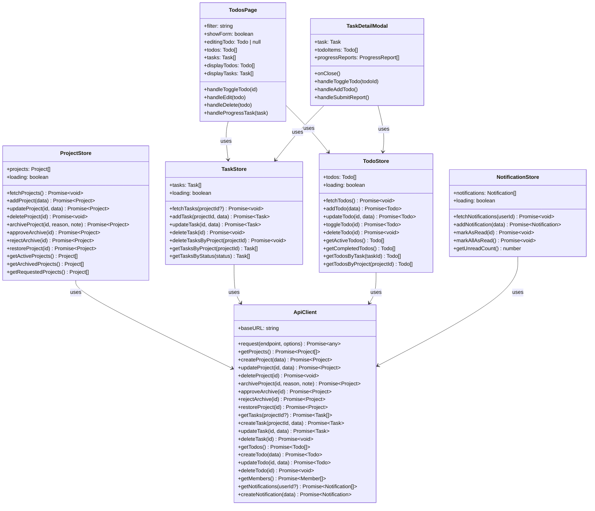
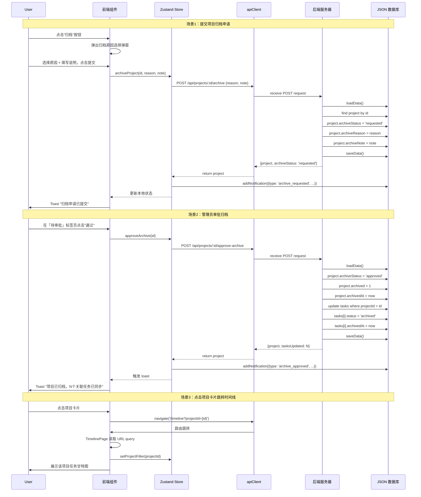
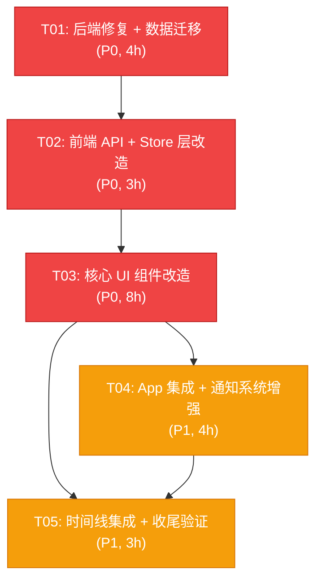

# 项目工作台 — 系统架构设计文档

> 版本：v2.0
> 日期：2026-08-15
> 作者：Bob（架构师）

---

## Part A: 系统架构设计

### 1. 实现路径分析

#### 1.1 核心挑战识别

| 挑战 | 现有状况 | 解决方案 |
|------|----------|----------|
| Bug P0-1/2/3/4/5 快速修复 | API 端点缺失 + 前后端字段不一致 | 后端补齐端点；前端统一 camelCase 字段名 |
| 归档审批流程 | 后端完全缺失 | 新增 `/api/projects/:id/archive` 等系列端点 |
| 任务弹窗集成待办 | 当前 TaskProgressModal 只有进度汇报 | 重命名为 TaskDetailModal，左右分栏 |
| 待办独立视图 | TodosPage 混合显示待办+任务 | 重构为两个独立 section |
| 时间线项目过滤 | TimelinePage 无 URL 参数支持 | 读取 `?projectId=` query 参数 |
| 字段名不统一 | 后端用 `project_id`，前端用 `projectId` | 后端统一返回 camelCase |

#### 1.2 技术栈（沿用现有）

- **前端**：React 18 + Vite + Zustand（persist）+ Tailwind CSS + react-router-dom
- **后端**：Node.js 原生 http 模块 + JSON 文件数据库（`data/workbench.db`）
- **路由**：react-router-dom v6（browser history）
- **图标**：lucide-react

#### 1.3 架构模式

沿用现有 MVC 分层：
```
Routes (App.jsx)
  └─ Pages
        └─ Components (展示层)
              └─ Store (状态层，Zustand persist)
                    └─ apiClient.js
                          └─ server/simple-server.js
                                └─ data/workbench.db
```

---

### 2. 数据模型设计（JSON 文件数据库）

> 说明：项目使用 JSON 文件作为数据库（`data/workbench.db`），无外部 DB 依赖。Schema 变更通过数据迁移脚本完成。

#### 2.1 Projects 表结构

```json
{
  "projects": [
    {
      "id": "uuid-v4",
      "name": "string",
      "code": "XM_xxx",
      "description": "string",
      "status": "active | paused | completed | archived",
      "archived": 0,
      "color": "string (hex)",
      "startDate": "YYYY-MM-DD",
      "endDate": "YYYY-MM-DD",
      "manager": "string",
      "created_at": "ISO8601",
      "updated_at": "ISO8601",

      "archiveStatus": "none | requested | approved | rejected",
      "archiveReason": "string",
      "archiveNote": "string",
      "archivedAt": "ISO8601 | null"
    }
  ]
}
```

#### 2.2 Tasks 表结构

```json
{
  "tasks": [
    {
      "id": "uuid-v4",
      "projectId": "uuid",
      "title": "string",
      "description": "string",
      "status": "todo | in_progress | review | done | blocked | archived",
      "priority": "high | medium | low",
      "assignee": "string (userId)",
      "startDate": "YYYY-MM-DD",
      "dueDate": "YYYY-MM-DD",
      "tags": ["string"],
      "progressReports": [
        {
          "id": "string",
          "no": "number",
          "date": "YYYY-MM-DD",
          "content": "string",
          "progress": "number",
          "reporter": "string",
          "reporterId": "string"
        }
      ],
      "created_at": "ISO8601",
      "updated_at": "ISO8601",
      "archivedAt": "ISO8601 | null"
    }
  ]
}
```

#### 2.3 Todos 表结构

```json
{
  "todos": [
    {
      "id": "uuid-v4",
      "title": "string",
      "description": "string",
      "completed": false,
      "completedAt": "ISO8601 | null",
      "priority": "urgent | high | medium | low",
      "dueDate": "YYYY-MM-DD | null",
      "assignee": "string",
      "projectId": "string | null",
      "taskId": "string | null",
      "remindDays": 3,
      "remindAt": "string | null",
      "enableEscalation": false,
      "created_at": "ISO8601",
      "updated_at": "ISO8601"
    }
  ]
}
```

#### 2.4 数据迁移方案

**触发时机**：后端启动时执行一次迁移脚本（`server/scripts/migrate.js`）

```javascript
// migrate.js 核心逻辑
function migrate(data) {
  // 1. projects 表新增字段
  data.projects.forEach(p => {
    p.archiveStatus = p.archiveStatus || 'none';
    p.archiveReason = p.archiveReason || '';
    p.archiveNote = p.archiveNote || '';
    p.archivedAt = p.archivedAt || (p.archived ? new Date().toISOString() : null);
  });
  // 2. tasks 表新增字段
  data.tasks.forEach(t => {
    t.archivedAt = t.archivedAt || null;
    // 字段名兼容：project_id → projectId
    if (t.project_id && !t.projectId) t.projectId = t.project_id;
  });
  // 3. todos 表新增字段
  data.todos.forEach(t => {
    t.taskId = t.taskId || null;
    t.remindDays = t.remind_days || t.remindDays || 3;
    t.enableEscalation = t.enable_escalation !== undefined ? t.enable_escalation : (t.enableEscalation || false);
  });
  return data;
}
```

---

### 3. API 接口设计

#### 3.1 已有接口（需修复/增强）

| 方法 | 路径 | 说明 | 状态 |
|------|------|------|------|
| GET | `/api/projects` | 获取所有项目 | ✅ 已有 |
| POST | `/api/projects` | 创建项目 | ✅ 已有 |
| PUT | `/api/projects/:id` | 更新项目（含归档字段） | ✅ 已有，需扩展 |
| DELETE | `/api/projects/:id` | 删除项目（**级联删除任务**） | ⚠️ 需增强 |
| GET | `/api/projects/:id/tasks` | 获取项目任务 | ✅ 已有 |
| POST | `/api/projects/:id/tasks` | 创建任务 | ✅ 已有 |
| GET | `/api/tasks` | 获取所有任务 | 🔴 **缺失，需新增** |
| PUT | `/api/tasks/:id` | 更新任务 | ✅ 已有 |
| DELETE | `/api/tasks/:id` | 删除任务 | ✅ 已有 |

#### 3.2 新增接口

| 方法 | 路径 | 说明 | 请求体 | 响应 |
|------|------|------|--------|------|
| POST | `/api/projects/:id/archive` | 提交归档申请 | `{ reason, note }` | 200 `{ project, archiveStatus: 'requested' }` |
| POST | `/api/projects/:id/approve-archive` | 审批通过归档 | `{}` | 200 `{ project, tasksUpdated: N }` |
| POST | `/api/projects/:id/reject-archive` | 驳回归档申请 | `{}` | 200 `{ project, archiveStatus: 'rejected' }` |
| POST | `/api/projects/:id/restore` | 恢复已归档项目 | `{}` | 200 `{ project, tasksRestored: N }` |
| POST | `/api/todos/:id` | 更新待办 | 任意字段 | 200 todo |

#### 3.3 请求/响应格式规范

**统一响应格式**：
```json
{
  "code": 200,
  "data": {},
  "message": "成功"
}
```

**归档申请请求**：
```json
// POST /api/projects/:id/archive
{
  "reason": "项目已完成",
  "note": "项目已通过验收，相关资料已归档"
}
```

**归档审批请求**：
```json
// POST /api/projects/:id/approve-archive
{}
// 或 POST /api/projects/:id/reject-archive
{}
```

---

### 4. 类图设计（Mermaid）



---

### 5. 调用时序图（Mermaid）



---

### 6. 待澄清事项

| ID | 问题 | 假设/决策 |
|----|------|----------|
| Q1 | 归档审批通知是否推送企微？ | **P1 暂不做企微推送**，仅站内通知。后续可接入轻流 webhook |
| Q2 | 项目删除时，里程碑是否同步删除？ | **建议同步删除**，保持数据一致性（同任务级联删除） |
| Q3 | `completed` 字段后端存储是 number(0/1) 还是 boolean？ | 后端已用 `body.completed || 0`，前端统一发 boolean，后端转 number 存储 |
| Q4 | 任务弹窗待办列表的实时刷新 | 打开弹窗时调用 `fetchTodos()`，弹窗关闭时触发 Zustand 状态自动同步 |

---

## Part B: 任务分解

### 7. 所需第三方包

```
- react@^18.2.0: UI 框架
- react-dom@^18.2.0: React DOM
- react-router-dom@^6.x: 路由管理（已存在）
- zustand@^4.x: 状态管理（已存在）
- lucide-react: 图标库（已存在）
- clsx/tailwind-merge: 样式工具（已存在）
```

> **结论：无需新增任何第三方包**，全部使用现有依赖。

---

### 8. 任务列表（按依赖顺序）

#### T01 — 后端修复 + 数据库迁移（基础设施 + Bug 修复）

- **描述**：修复 P0-1/2/3/4/5 五个阻断性 Bug，补齐归档相关 API 端点，编写数据迁移脚本确保新字段有默认值
- **所属模块**：后端（server）
- **优先级**：P0
- **依赖**：无
- **涉及文件**：
  - `server/scripts/migrate.js`（新建：数据迁移脚本）
  - `server/simple-server.js`（修改：新增 GET /api/tasks、归档审批系列端点、级联删除）
  - `server/db/index.js`（检查：确认 schema 兼容性）
- **估算工时**：4h

#### T02 — 前端 API 层 + Store 层改造

- **描述**：在 apiClient 中新增归档相关方法，扩展 TaskStore（支持无参 fetchTasks）、ProjectStore（归档审批方法）、TodoStore（taskId 支持），统一字段名为 camelCase
- **所属模块**：前端数据层
- **优先级**：P0
- **依赖**：T01
- **涉及文件**：
  - `src/lib/apiClient.js`（修改：新增 archive/approve/reject/restore/task 方法）
  - `src/store/useTaskStore.js`（修改：fetchTasks 支持无参、getTasksByProject 修复字段名、新增 deleteTasksByProject）
  - `src/store/useProjectStore.js`（修改：新增 archiveProject/approveArchive/rejectArchive/restoreProject）
  - `src/store/useTodoStore.js`（修改：toggleTodo 字段兼容、新增 getTodosByTask/getTodosByProject）
- **估算工时**：3h

#### T03 — 核心 UI 组件改造

- **描述**：修复 TaskForm.jsx addTask 调用参数；重构 TaskProgressModal → TaskDetailModal（左右分栏：左侧待办列表 + 右侧进度汇报）；TodosPage 重构为双独立区域（待办独立 + 任务独立）；逾期高亮样式；待办按截止日升序排序
- **所属模块**：前端组件层
- **优先级**：P0
- **依赖**：T02
- **涉及文件**：
  - `src/components/tasks/TaskForm.jsx`（修改：addTask 传 projectId）
  - `src/components/tasks/TaskProgressModal.jsx`（重命名 → TaskDetailModal.jsx，重写为左右分栏布局）
  - `src/pages/TodosPage.jsx`（重构：两个独立 section + 筛选标签）
  - `src/components/todos/TodoList.jsx`（修改：逾期红色高亮 + 排序逻辑）
  - `src/pages/ProjectsPage.jsx`（修改：项目卡片点击跳转时间线、新增「待审批归档」标签页）
- **估算工时**：8h

#### T04 — App.jsx 集成 + 通知系统增强

- **描述**：App.jsx 启动时并行调用 fetchTasks()；新建 TaskDetailModal 的导入；ProjectsPage 集成归档审批流程 UI（申请弹窗、审批操作、恢复按钮）；通知类型扩展到 archive_requested/approved/rejected/project_deleted
- **所属模块**：前端集成层
- **优先级**：P1
- **依赖**：T03
- **涉及文件**：
  - `src/App.jsx`（修改：加入 fetchTasks 并行调用）
  - `src/pages/ProjectsPage.jsx`（修改：归档申请弹窗 + 审批操作按钮 + 恢复按钮）
  - `src/store/useNotificationStore.js`（修改：扩展 NOTIF_TYPES 常量）
  - `src/store/useProjectStore.js`（修改：归档/审批成功后触发通知创建）
- **估算工时**：4h

#### T05 — 时间线集成 + 收尾验证

- **描述**：TimelinePage 读取 URL `?projectId=` 参数，自动过滤并锁定项目选择器，甘特图起点改为项目 startDate；端到端验证所有 P0 功能验收标准；代码 review
- **所属模块**：前端路由/集成
- **优先级**：P1
- **依赖**：T03, T04
- **涉及文件**：
  - `src/pages/TimelinePage.jsx`（修改：URL query 参数解析 + 项目过滤锁定 + 甘特图起点计算）
  - `src/pages/ProjectsPage.jsx`（完善：归档后项目移入「已归档」标签页的筛选逻辑）
- **估算工时**：3h

---

### 9. 共享知识（给工程师）

```markdown
- 所有 API 响应统一使用 { code, data, message } 格式
- 前端统一使用 camelCase（projectId、taskId、dueDate、completedAt），后端返回时也转换为 camelCase
- 所有日期格式：YYYY-MM-DD（日期）/ ISO 8601 UTC（时间戳）
- 归档状态流转：none → requested → approved(archived=1) 或 rejected
- 项目删除级联规则：DELETE /api/projects/:id 时同时删除该项目的全部关联任务
- 任务弹窗内「新增待办」自动继承 projectId 和 taskId（通过 Modal props 传入）
- 待办完成状态双向同步：TodosPage 勾选 → Zustand → TaskDetailModal 实时可见
- 项目卡片点击跳转时间线：navigate('/timeline?projectId=' + project.id)
- TimelinePage 的 projectFilter 状态被 URL 参数初始化时禁用选择器
```

---

### 10. 任务依赖图



---

### 关键决策点总结

| 决策 | 理由 |
|------|------|
| 不引入新第三方包 | 现有依赖已足够，避免增加维护成本 |
| 后端 JSON 文件 DB 不改 SQLite | 项目定位轻量，文件 DB 满足当前数据量；后续如需可迁移 |
| 归档审批仅站内通知 | P1 需求，暂不接入企微；后续可扩展 qingflow webhook |
| 字段名统一 camelCase | 前端现有风格，后端返回时转换，避免前后端字段名混淆 |
| 项目卡片点击 → 时间线 | 利用 react-router query 参数，无需新增页面路由 |
| TaskDetailModal 左右分栏 6:4 | 待办为主操作区，进度汇报为辅，符合用户高频使用场景 |
