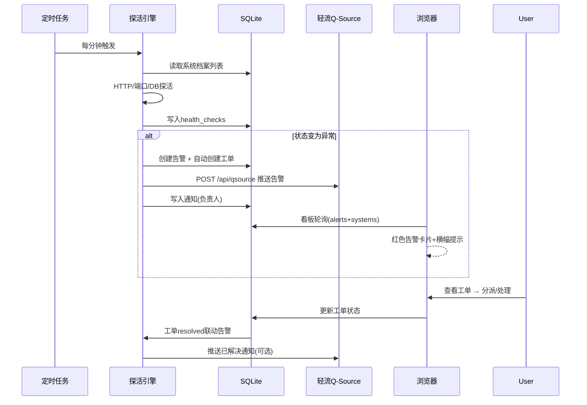

# 信息化中心管理平台 - 架构设计文档

> **版本**：v1.0  
> **日期**：2026-08-15  
> **编制**：软件开发团队 · 主理人齐活林（基于已确认PRD）  
> **前置文档**：docs/itc-platform-prd.md（已确认）  
> **状态**：待确认后进入开发

---

## 一、整体架构方案

### 1.1 架构模式

采用**前后端分离单页应用 + 轻量后端 API + 定时任务引擎**架构：

```
┌─────────────────────────────────────────────────────────────┐
│                       浏览器 (React SPA)                      │
│       M1看板 │ M2工单 │ M3项目 │ M4工作台 │ M5知识库           │
└──────────────────────────┬──────────────────────────────────┘
                           │ REST API (JSON)
┌──────────────────────────▼──────────────────────────────────┐
│                    Node.js Express 后端                       │
│  ┌──────────┬──────────┬──────────┬──────────────────────┐  │
│  │ Auth用户  │ 系统档案   │ 工单管理   │ 项目/任务管理          │  │
│  ├──────────┼──────────┼──────────┼──────────────────────┤  │
│  │ 知识库/供应商│ 通知      │ 统计报表   │ 轻流集成(Q-Source)     │  │
│  └──────────┴──────────┴──────────┴──────────────────────┘  │
│  ┌────────────────────────────────────────────────────────┐ │
│  │          定时任务引擎 (node-cron)                        │ │
│  │  ● 探活调度(每1-5min)  ● 告警生成  ● 巡检提醒  ● 数据统计    │ │
│  └────────────────────────────────────────────────────────┘ │
└──────────────────────────┬──────────────────────────────────┘
                           │
┌──────────────────────────▼──────────────────────────────────┐
│                     SQLite 数据库 (better-sqlite3)           │
└─────────────────────────────────────────────────────────────┘
```

### 1.2 技术选型（已确认）

| 层级 | 技术 | 版本建议 | 理由 |
|------|------|---------|------|
| 前端 | React + Vite | React 18, Vite 5 | 构建快，开发体验好 |
| UI | MUI + Tailwind CSS | MUI 5 | 组件丰富，快速搭建 |
| 路由/状态 | React Router + Zustand | Router 6 | 轻量状态管理 |
| 后端 | Node.js + Express | Express 4 | 与前端同语言，生态成熟 |
| 数据库 | better-sqlite3 | 9.x | 同步API简单，单文件，适合小团队 |
| 定时任务 | node-cron | 3.x | 探活/巡检/统计调度 |
| HTTP探活 | 内置fetch (Node 18+) | - | 零依赖探活 |
| 部署 | Docker Compose | - | 内网服务器一键部署（Q1确认） |
| 通知推送 | 轻流Q-Source API | - | 复用现有qingflow.js模式（Q5确认） |

### 1.3 架构决策说明

| 决策 | 说明 |
|------|------|
| D1: SQLite而非PostgreSQL | 4人内部使用、单服务器部署，SQLite零运维成本。数据量小（工单/系统状态），单文件备份简单。预留迁移路径 |
| D2: 探活自建而非Zabbix | Q4确认无现成监控工具。自建探活引擎（HTTP状态码+响应时间+端口+DB连接），满足内网7个系统场景 |
| D3: 通知走轻流Q-Source | Q5确认。复用现有 `server/qingflow.js` 的 `POST /api/qsource/{qsourceId}` 模式，字段映射保持一致（bt/ms/zrr/yxj/jzrq/ssxm/zht） |
| D4: 自建用户认证 | Q7确认不接AD/LDAP。简单的用户名+密码+JWT，密码哈希用bcryptjs，预留LDAP适配接口 |
| D5: MVP只做P0模块 | Q8越快越好。M1+M2+M4为首批，M3项目管理的看板/任务子集随P1迭代 |

---

## 二、MVP范围界定（第一阶段）

### 2.1 包含（P0）

| 模块 | 包含功能 |
|------|---------|
| M1 系统健康看板 | 系统档案CRUD、探活引擎、状态卡片、告警列表、轻流推送告警 |
| M2 IT工单管理 | 工单CRUD、分派、状态流转、SLA计时、看板视图、统计报表 |
| M4 团队工作台 | 个人仪表盘（今日工单/告警/消息）、工作量视图、通知中心 |
| 基础能力 | 用户登录认证、系统设置、轻流配置 |

### 2.2 不包含（P1/P2迭代）

- ❌ M3 项目管理全量（仅保留"问题转工单"联动入口预留）
- ❌ M5 知识库、M6 供应商、M7 BPM聚合（P1）
- ❌ M8 主数据、M9 资产、M10 巡检（P2）
- ❌ 业务用户报障入口（Q2确认P1开放）

---

## 三、目录/文件结构

```
itc-platform/
├── docker-compose.yml          # 一键部署
├── Dockerfile                  # 多阶段构建(前端→静态+后端)
├── package.json                # 根工作区脚本
├── README.md                   # 使用说明
├── server/
│   ├── package.json            # 后端依赖
│   ├── index.js                # 服务入口(加载路由+启动定时任务)
│   ├── app.js                  # Express应用装配
│   ├── db/
│   │   ├── index.js            # better-sqlite3连接+初始化建表
│   │   └── seed.js             # 种子数据(默认用户/示例系统)
│   ├── middleware/
│   │   ├── auth.js             # JWT认证中间件
│   │   └── errorHandler.js     # 统一错误处理
│   ├── routes/
│   │   ├── auth.js             # 登录/用户管理
│   │   ├── systems.js          # M1系统档案
│   │   ├── health.js           # M1探活记录/手动触发
│   │   ├── tickets.js          # M2工单
│   │   ├── dashboard.js        # M4个人仪表盘聚合
│   │   ├── notifications.js    # 通知中心
│   │   └── settings.js         # 系统设置(轻流配置等)
│   ├── services/
│   │   ├── healthCheck.js      # 探活引擎(核心)
│   │   ├── qingflow.js         # 轻流Q-Source推送(复用现有代码模式)
│   │   ├── notification.js     # 通知生成/推送协调
│   │   ├── sla.js              # SLA计时计算
│   │   └── stats.js            # 统计报表聚合
│   ├── jobs/
│   │   ├── scheduler.js        # node-cron任务注册
│   │   └── healthJob.js        # 定时探活任务
│   └── data/                   # SQLite数据库文件目录(.gitignore)
├── web/
│   ├── package.json
│   ├── vite.config.js          # 开发代理→后端:3001
│   ├── index.html
│   └── src/
│       ├── main.jsx
│       ├── App.jsx             # 路由装配
│       ├── api/
│       │   └── client.js       # fetch封装(带token)
│       ├── store/
│       │   └── useAuthStore.js # 登录态管理(Zustand)
│       ├── layouts/
│       │   └── MainLayout.jsx  # 侧边导航+顶栏
│       ├── pages/
│       │   ├── Login.jsx       # 登录页
│       │   ├── Dashboard.jsx   # M4: 团队工作台
│       │   ├── Systems.jsx     # M1: 系统看板
│       │   ├── Tickets.jsx     # M2: 工单列表
│       │   ├── TicketDetail.jsx# M2: 工单详情
│       │   └── Settings.jsx    # 设置(轻流/系统参数)
│       └── components/
│           ├── SystemCard.jsx  # 系统状态卡片
│           ├── TicketBoard.jsx # 工单看板(拖拽)
│           ├── AlertBanner.jsx # 告警横幅
│           └── StatusBadge.jsx # 状态标签
└── docs/
    ├── itc-platform-prd.md         # 需求文档(已确认)
    └── itc-platform-architecture.md # 本文档
```

---

## 四、数据模型设计

### 4.1 表结构

```sql
-- 用户表
CREATE TABLE users (
  id INTEGER PRIMARY KEY AUTOINCREMENT,
  username TEXT UNIQUE NOT NULL,      -- 登录名(工号)
  name TEXT NOT NULL,                  -- 姓名
  password_hash TEXT NOT NULL,         -- bcrypt哈希
  role TEXT NOT NULL DEFAULT 'member', -- admin | member
  email TEXT,                          -- 用于轻流zrr字段
  avatar TEXT,
  created_at TEXT DEFAULT (datetime('now','localtime')),
  updated_at TEXT DEFAULT (datetime('now','localtime'))
);

-- 系统档案表 (M1)
CREATE TABLE systems (
  id INTEGER PRIMARY KEY AUTOINCREMENT,
  name TEXT NOT NULL,                  -- 系统名称 ERP/PLM/QMS/MES-MOM/BPM...
  code TEXT UNIQUE NOT NULL,           -- 系统编码 erp/plm/qms/mom/bpm
  version TEXT,                        -- 当前版本
  base_url TEXT,                       -- 探活基础URL
  health_type TEXT DEFAULT 'http',     -- http | tcp | db
  health_path TEXT,                    -- 探活路径 /health 等
  db_host TEXT, db_port INTEGER,       -- DB探活参数
  db_type TEXT,                        -- mysql/oracle/sqlserver/postgres
  expected_status INTEGER DEFAULT 200, -- 期望HTTP状态码
  check_interval INTEGER DEFAULT 5,    -- 探活间隔(分钟)
  owner_id INTEGER REFERENCES users(id), -- 负责人
  vendor TEXT,                         -- 厂商(用友/思普/赛意/轻流/自研)
  description TEXT,                    -- 系统说明
  is_active INTEGER DEFAULT 1,
  created_at TEXT DEFAULT (datetime('now','localtime'))
);

-- 健康检查记录表 (M1)
CREATE TABLE health_checks (
  id INTEGER PRIMARY KEY AUTOINCREMENT,
  system_id INTEGER NOT NULL REFERENCES systems(id),
  status TEXT NOT NULL,                -- ok | warning | down
  response_time INTEGER,               -- 毫秒
  http_code INTEGER,                   -- HTTP状态码
  message TEXT,                        -- 错误信息/检查详情
  checked_at TEXT DEFAULT (datetime('now','localtime'))
);
CREATE INDEX idx_health_system ON health_checks(system_id, checked_at DESC);

-- 系统告警表 (M1)
CREATE TABLE alerts (
  id INTEGER PRIMARY KEY AUTOINCREMENT,
  system_id INTEGER NOT NULL REFERENCES systems(id),
  level TEXT NOT NULL,                 -- critical | warning | recovered
  title TEXT NOT NULL,
  content TEXT,
  status TEXT DEFAULT 'open',          -- open | acknowledged | resolved
  ticket_id INTEGER REFERENCES tickets(id), -- 联动工单
  pushed_qingflow INTEGER DEFAULT 0,   -- 是否已推送轻流
  created_at TEXT DEFAULT (datetime('now','localtime')),
  resolved_at TEXT
);

-- 工单表 (M2)
CREATE TABLE tickets (
  id INTEGER PRIMARY KEY AUTOINCREMENT,
  ticket_no TEXT UNIQUE NOT NULL,      -- 工单号 TKT-20260815-001
  title TEXT NOT NULL,
  description TEXT,
  category TEXT NOT NULL,              -- erp/plm/qms/mes/bpm/network/hardware/other
  priority TEXT DEFAULT 'medium',      -- low | medium | high | urgent
  status TEXT DEFAULT 'open',          -- open | assigned | in_progress | pending_verify | resolved | closed
  system_id INTEGER REFERENCES systems(id),
  reporter_id INTEGER REFERENCES users(id),   -- 提交人
  assignee_id INTEGER REFERENCES users(id),   -- 处理人
  source TEXT DEFAULT 'web',           -- web | alert | qingflow | manual
  alert_id INTEGER REFERENCES alerts(id),     -- 来源告警
  sla_response_due TEXT,               -- 响应时限
  sla_resolve_due TEXT,                -- 解决时限
  response_at TEXT,                    -- 首次响应时间
  resolved_at TEXT,                    -- 解决时间
  closed_at TEXT,
  solution TEXT,                       -- 处理方案(关闭时填写)
  tags TEXT,                           -- 逗号分隔标签
  created_at TEXT DEFAULT (datetime('now','localtime')),
  updated_at TEXT DEFAULT (datetime('now','localtime'))
);
CREATE INDEX idx_ticket_status ON tickets(status);
CREATE INDEX idx_ticket_assignee ON tickets(assignee_id);

-- 工单操作记录表 (M2 审计)
CREATE TABLE ticket_actions (
  id INTEGER PRIMARY KEY AUTOINCREMENT,
  ticket_id INTEGER NOT NULL REFERENCES tickets(id),
  action TEXT NOT NULL,                -- create | assign | status_change | comment | resolve | close
  operator_id INTEGER REFERENCES users(id),
  from_status TEXT, to_status TEXT,
  comment TEXT,
  created_at TEXT DEFAULT (datetime('now','localtime'))
);

-- 通知表 (M4)
CREATE TABLE notifications (
  id INTEGER PRIMARY KEY AUTOINCREMENT,
  user_id INTEGER NOT NULL REFERENCES users(id),
  type TEXT NOT NULL,                  -- ticket_assigned | alert | ticket_status | system
  title TEXT NOT NULL,
  content TEXT,
  link TEXT,                           -- 前端跳转路径
  is_read INTEGER DEFAULT 0,
  created_at TEXT DEFAULT (datetime('now','localtime'))
);
CREATE INDEX idx_notif_user ON notifications(user_id, is_read);

-- 轻流配置表 (单行配置)
CREATE TABLE settings (
  key TEXT PRIMARY KEY,                -- qingflow_base_url / qingflow_qsource_id / ...
  value TEXT,
  updated_at TEXT DEFAULT (datetime('now','localtime'))
);

-- 种子数据
-- 默认管理员 admin / admin123 (首次登录后修改)
```

### 4.2 状态枚举（共享约定）

```js
// 工单状态机
TICKET_STATUS = {
  open: '待处理',
  assigned: '已分派',
  in_progress: '处理中',
  pending_verify: '待验证',
  resolved: '已解决',
  closed: '已关闭'
};

// 系统运行状态
SYSTEM_HEALTH = { ok: '正常', warning: '告警', down: '宕机' };

// 告警级别
ALERT_LEVEL = { critical: '严重', warning: '警告', recovered: '已恢复' };

// 优先级
PRIORITY = { low: '低', medium: '中', high: '高', urgent: '紧急' };
```

---

## 五、API 接口设计

### 5.1 认证

| 方法 | 路径 | 说明 |
|------|------|------|
| POST | /api/auth/login | 登录，返回 JWT |
| GET | /api/auth/me | 当前用户信息 |
| PUT | /api/auth/password | 修改密码 |
| GET | /api/users | 用户列表（分派下拉用） |

### 5.2 M1 系统健康看板

| 方法 | 路径 | 说明 |
|------|------|------|
| GET | /api/systems | 系统列表（含最新健康状态） |
| POST | /api/systems | 新增系统档案 |
| GET | /api/systems/:id | 系统详情 |
| PUT | /api/systems/:id | 更新系统档案 |
| DELETE | /api/systems/:id | 删除系统 |
| POST | /api/systems/:id/check | 手动触发单系统探活 |
| GET | /api/systems/:id/history | 探活历史（最近N条） |
| GET | /api/alerts | 告警列表（filter: status/level） |
| POST | /api/alerts/:id/acknowledge | 确认告警 |
| POST | /api/alerts/:id/resolve | 关闭告警（联动工单） |

### 5.3 M2 工单管理

| 方法 | 路径 | 说明 |
|------|------|------|
| GET | /api/tickets | 工单列表（filter: status/assignee/category/priority/keyword） |
| POST | /api/tickets | 创建工单 |
| GET | /api/tickets/:id | 工单详情（含操作记录） |
| PUT | /api/tickets/:id | 更新工单（标题/描述/优先级） |
| POST | /api/tickets/:id/assign | 分派（body: assigneeId） |
| POST | /api/tickets/:id/status | 状态流转（body: toStatus, comment） |
| POST | /api/tickets/:id/comment | 添加评论 |
| GET | /api/tickets/stats | 统计（按状态/系统/人员/SLA） |
| DELETE | /api/tickets/:id | 删除（仅admin） |

### 5.4 M4 团队工作台

| 方法 | 路径 | 说明 |
|------|------|------|
| GET | /api/dashboard/overview | 我的待办聚合（今日工单/告警/未读通知/我的系统告警数） |
| GET | /api/dashboard/workload | 团队工作量（每人工单数/处理中/逾期）仅admin |
| GET | /api/notifications | 我的通知列表 |
| POST | /api/notifications/:id/read | 标记已读 |
| POST | /api/notifications/read-all | 全部已读 |

### 5.5 设置

| 方法 | 路径 | 说明 |
|------|------|------|
| GET | /api/settings | 获取设置（轻流配置等） |
| PUT | /api/settings | 更新设置 |
| POST | /api/settings/test-qingflow | 测试轻流连接（推送测试消息） |

### 5.6 统一返回格式

```json
// 成功
{ "success": true, "data": { ... } }
// 失败
{ "success": false, "error": { "code": "TICKET_NOT_FOUND", "message": "工单不存在" } }
```

---

## 六、探活引擎设计（M1核心）

### 6.1 探活类型

| 类型 | 检测方式 | 判定规则 |
|------|---------|---------|
| http | GET {base_url}{health_path} | 状态码=expected_status → ok；超时/网络错误 → down；4xx/5xx → warning |
| tcp | net.connect(host, port) | 连接成功 → ok；失败 → down |
| db | 连接串+简单查询(SELECT 1) | 成功 → ok；失败 → down |

### 6.2 调度策略

```
node-cron 每分钟执行 healthJob:
  1. 查询所有 is_active=1 的 systems
  2. 对每个系统判断: 距上次检查时间 >= check_interval 分钟 → 执行探活
  3. 记录 health_checks，更新系统当前状态
  4. 状态变化规则:
     - ok → down: 创建 critical 告警 + 自动生成工单 + 推送轻流
     - ok/warning → ok: 创建 recovered 告警（自动resolved旧告警）
     - 连续3次down: 提升为严重(critical)，重复推送轻流(去重:同系统critical每30分钟最多推1次)
  5. 写通知给系统负责人
```

### 6.3 告警→工单→通知链路

```
探活异常
   │
   ▼
health_checks 记录(down/warning)
   │
   ▼
alerts 创建 (level=critical/warning, status=open)
   ├──▶ 自动创建工单 ticket (source=alert, category=系统类别, priority按告警级别)
   ├──▶ 推送轻流Q-Source (bt=【系统告警】标题, ms=详情, zrr=负责人邮箱, yxj=urgent)
   └──▶ notifications 通知系统负责人
   │
   ▼
负责人确认告警(acknowledge) → 处理工单 → 解决工单
   │
   ▼
工单resolved → 关联告警自动resolved → 推送轻流恢复通知(可选)
```

---

## 七、轻流 Q-Source 集成设计

### 7.1 复用现有模式

```js
// services/qingflow.js — 基于现有 server/qingflow.js 适配
const QFLOW_FIELDS = {
  title: 'bt',        // 标题
  desc: 'ms',         // 描述
  assignee: 'zrr',    // 责任人(邮箱)
  priority: 'yxj',    // 优先级
  dueDate: 'jzrq',    // 截止日期
  project: 'ssxm',    // 所属项目
  status: 'zht',      // 状态
};

async function pushAlert(alert, system, ownerEmail) {
  const payload = {
    bt: `【系统告警】${system.name} ${alert.level === 'critical' ? '宕机' : '异常'}`,
    ms: `${alert.content}\n系统: ${system.name}\n时间: ${alert.created_at}`,
    zrr: ownerEmail || '',
    yxj: alert.level === 'critical' ? 'urgent' : 'high',
    jzrq: '',
    ssxm: '信息化中心管理平台',
    zht: '待处理',
  };
  return qingflowRequest('POST', `${baseUrl}/api/qsource/${qsourceId}`, payload);
}
```

### 7.2 配置管理

```
settings 表:
  qingflow_base_url   = https://gkbpm.grinm.com:56555  (待确认实际地址)
  qingflow_qsource_id = UUID (轻流后台获取)
```

前端设置页提供配置+测试连接按钮（复用 testConnection 逻辑）。

---

## 八、模块间调用关系（时序图）



---

## 九、依赖包清单

### server/package.json

```json
{
  "dependencies": {
    "express": "^4.19.2",
    "better-sqlite3": "^9.6.0",
    "bcryptjs": "^2.4.3",
    "jsonwebtoken": "^9.0.2",
    "node-cron": "^3.0.3",
    "cors": "^2.8.5"
  },
  "devDependencies": {
    "nodemon": "^3.1.0"
  }
}
```

### web/package.json

```json
{
  "dependencies": {
    "react": "^18.3.1",
    "react-dom": "^18.3.1",
    "react-router-dom": "^6.24.0",
    "zustand": "^4.5.4",
    "@mui/material": "^5.16.0",
    "@emotion/react": "^11.11.4",
    "@emotion/styled": "^11.11.5",
    "axios": "^1.7.2"
  },
  "devDependencies": {
    "vite": "^5.3.0",
    "@vitejs/plugin-react": "^4.3.0",
    "tailwindcss": "^3.4.0",
    "postcss": "^8.4.0",
    "autoprefixer": "^10.4.0"
  }
}
```

---

## 十、共享知识（跨文件约定）

1. **命名规范**：文件/路由 kebab-case；组件 PascalCase；API返回统一 `{success, data}` 或 `{success, error}`
2. **错误处理**：routes 捕获异常 → 抛给 errorHandler 中间件 → 返回 `{success:false, error:{code,message}}`
3. **时间格式**：数据库统一 `datetime('now','localtime')` 字符串；前端显示用 dayjs 格式化
4. **状态枚举**：以上4.2节枚举为唯一权威，前端/后端共用
5. **认证**：JWT存 localStorage，axios拦截器自动带 `Authorization: Bearer <token>`；401跳登录页
6. **权限**：role=admin 才能管理用户/系统设置；member 只能处理分派给自己的工单（查看全部）
7. **轻流推送**：所有对外推送集中在 services/qingflow.js，业务代码不直接调API
8. **工单编号**：`TKT-YYYYMMDD-XXX`（当日序号），数据库唯一索引

---

## 十一、任务列表（按实现顺序，供工程师执行）

| # | 任务 | 依赖 | 说明 |
|---|------|------|------|
| T1 | 初始化项目结构（根目录+docker文件+README） | - | 创建server/web两个子项目骨架 |
| T2 | 后端：db层（better-sqlite3建表+种子数据） | T1 | 按4.1节建全部表，插入admin用户 |
| T3 | 后端：认证（登录+JWT+中间件+密码修改） | T2 | POST /api/auth/*，测试curl |
| T4 | 后端：用户管理接口 | T3 | GET /api/users，供分派下拉 |
| T5 | 后端：系统档案CRUD | T2 | /api/systems/* |
| T6 | 后端：探活引擎+health_checks | T5 | services/healthCheck.js 三种探活类型 |
| T7 | 后端：定时任务调度器 | T6 | jobs/scheduler.js + healthJob.js |
| T8 | 后端：告警表+告警API | T6 | alerts CRUD + acknowledge/resolve |
| T9 | 后端：告警自动生成工单+通知 | T7,T8 | 状态变化联动 |
| T10 | 后端：轻流Q-Source推送集成 | T2 | services/qingflow.js + 设置接口 |
| T11 | 后端：工单CRUD+分派+状态流转+审计 | T8 | /api/tickets/* + ticket_actions |
| T12 | 后端：SLA计算+工单统计 | T11 | services/sla.js + /api/tickets/stats |
| T13 | 后端：仪表盘聚合+通知接口 | T9,T11 | /api/dashboard/* + /api/notifications |
| T14 | 前端：项目初始化(React+Vite+MUI+Tailwind) | T1 | Vite代理配置→:3001 |
| T15 | 前端：登录页+认证store+路由守卫 | T14 | useAuthStore + MainLayout骨架 |
| T16 | 前端：系统看板页(Systems) | T5,T6 | SystemCard列表+手动探活按钮 |
| T17 | 前端：工单列表+看板视图 | T11 | TicketBoard拖拽状态流转 |
| T18 | 前端：工单详情+评论+操作记录 | T11,T12 | 分派/评论/SLA展示 |
| T19 | 前端：仪表盘页(Dashboard) | T13 | 个人待办+团队工作量(admin) |
| T20 | 前端：设置页(轻流配置+测试) | T10 | 配置表单+测试连接按钮 |
| T21 | 联调+全局一致性审查 | 全部 | IS_PASS检查 |
| T22 | Docker部署配置+冒烟测试 | T21 | docker-compose启动验证 |
| T23 | QA测试用例+回归 | T22 | 核心流程自动化/手动测试 |

---

## 十二、待明确事项

| # | 事项 | 影响 | 处理建议 |
|---|------|------|---------|
| A1 | 轻流服务器实际地址和Q-Source ID | 推送链路 | 部署时在设置页配置即可，开发用mock |
| A2 | 7个系统的实际URL/端口/IP清单 | 探活初始化 | 上线时导入系统档案，开发用本地示例 |
| A3 | 探活是否需要内网跳板/代理 | 探活可达性 | 若无特殊网络，直接HTTP探活 |
| A4 | 前端UI风格偏好（MUI默认 vs 定制主题） | 视觉体验 | 默认MUI亮色主题，可后续定制 |

---

> **请杨大人审阅架构设计，确认后进入开发阶段（工程师寇豆码按任务列表T1-T23实施）。**