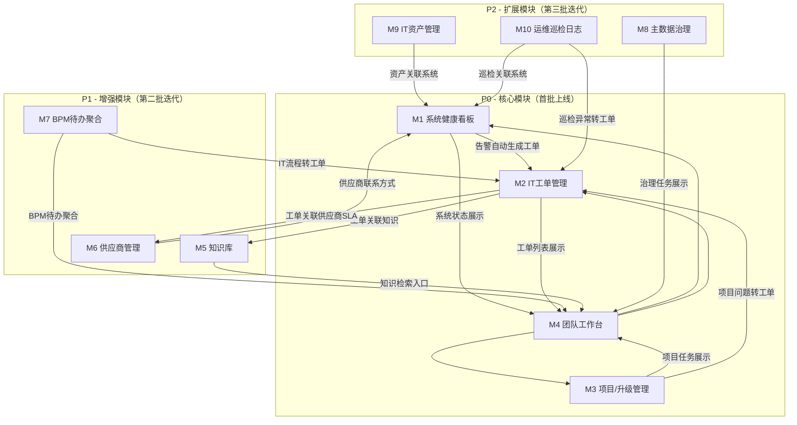

# 信息化中心管理平台 - 产品需求文档（PRD）

> **版本**：v1.0  
> **日期**：2026-08-15  
> **编制**：软件开发团队 · 主理人齐活林  
> **状态**：待用户确认

---

## 一、产品目标与愿景

### 1.1 产品定位

信息化中心管理平台是面向公司信息化中心的**内部效能管理工具**，服务于4人IT团队对5大已上线系统（ERP/PLM/QMS/MES(MOM)/BPM）+ 2个拟建系统（SRM/CRM）的日常运维、升级推进、用户支持和数据治理工作。

### 1.2 核心目标

| 目标 | 说明 |
|------|------|
| **一个面板看全局** | 4人团队管理7个系统，需要统一视图掌握所有系统的运行状态、待办事项、升级进度 |
| **工单不遗漏** | 用户报障、系统告警、BPM待办多渠道汇聚，避免靠微信群和口头传递导致遗漏 |
| **升级可追踪** | MES→MOM、ERP升级等重大项目的里程碑、问题、风险有结构化记录，不依赖个人记忆 |
| **知识能传承** | 4人团队人员少、单点风险高，系统文档、运维SOP、排障经验需沉淀为团队资产 |
| **供应商有台账** | 7个系统涉及多个厂商/实施方/运维方，合同、SLA、沟通记录需集中管理 |

### 1.3 设计原则

- **轻量优先**：4人团队，平台本身不能成为额外负担，开箱即用，少配置多使用
- **集成而非替代**：不替代ERP/PLM/BPM等业务系统，而是作为IT管理层的"指挥台"
- **移动友好**：运维人员常在机房或各业务部门走动，需支持手机查看工单和告警
- **渐进式建设**：P0模块先上线，后续模块按需迭代

---

## 二、用户角色定义

| 角色 | 人数 | 核心诉求 |
|------|------|---------|
| **IT中心主任** | 1人（杨大人） | 全局视图：系统健康度、项目进度、团队工作量、风险预警、供应商履约 |
| **系统管理员** | 2-3人 | 日常运维：工单处理、系统巡检、用户权限管理、问题排查、文档维护 |
| **全员（IT中心）** | 4人 | 个人工作台：今日待办、工单队列、项目任务、知识检索 |
| **业务用户（扩展）** | 全公司 | 报障入口：提交IT工单、查看处理进度、查阅操作手册（可选P2） |

---

## 三、核心功能模块

### 模块总览

| 序号 | 模块名称 | 优先级 | 一句话描述 |
|------|---------|--------|-----------|
| M1 | 系统健康看板 | **P0** | 一屏掌握7个系统运行状态 |
| M2 | IT工单管理 | **P0** | 用户报障+系统告警统一工单池 |
| M3 | 项目/升级管理 | **P0** | MES→MOM、ERP升级等项目追踪 |
| M4 | 团队工作台 | **P0** | 个人待办聚合+工作量视图 |
| M5 | 知识库 | **P1** | 系统文档/SOP/排障经验沉淀 |
| M6 | 供应商管理 | **P1** | 厂商合同/SLA/沟通记录台账 |
| M7 | BPM待办聚合 | **P1** | 聚合轻流100+流程中的IT相关待办 |
| M8 | 主数据治理 | **P2** | 数据标准/校验规则/治理任务 |
| M9 | IT资产管理 | **P2** | 硬件/许可证/系统实例台账 |
| M10 | 运维巡检日志 | **P2** | 日常巡检+变更操作记录 |

---

### M1：系统健康看板（P0）

**解决的痛点**：
- 7个系统分散在不同服务器和端口，日常需逐个登录检查，耗时且容易遗漏
- 系统出问题时，往往是业务用户先发现并投诉，IT团队被动响应
- 主任无法一眼掌握哪些系统正常、哪些有隐患

**关键功能点**：
1. **系统状态卡片**：每个系统一张卡片，显示：系统名称、版本、运行状态（正常/告警/宕机）、响应时间、最近检查时间
2. **健康检查机制**：定时HTTP探活 + 数据库连接检测 + 关键服务端口检测
3. **告警通知**：状态异常时自动推送到IT团队群（企业微信/钉钉）
4. **系统档案**：每个系统的基本信息（服务器IP、端口、数据库、负责人、厂商联系方式、部署架构图）
5. **资源监控**：CPU/内存/磁盘使用率（对接服务器Agent或Zabbix/Prometheus API）

---

### M2：IT工单管理（P0）

**解决的痛点**：
- 用户报障渠道混乱：微信群、口头、电话、BPM工单并存，无统一记录
- 工单分配靠口头指派，经常出现"以为别人处理了"的真空地带
- 故障处理过程无记录，同类问题反复出现却无法参考历史
- 月度/季度运维工作量无法量化，人手不足时缺乏数据支撑

**关键功能点**：
1. **多渠道工单接入**：
   - Web端表单提交（业务用户）
   - 企业微信/钉钉机器人提交
   - 系统告警自动生成工单（对接M1）
   - BPM轻流IT类流程同步（对接M7）
2. **工单全生命周期**：创建 → 分派 → 接收 → 处理 → 验证 → 关闭
3. **工单分类与SLA**：按系统分类（ERP/PLM/QMS/MES/BPM/网络/硬件），每类设定响应时效和解决时效
4. **工单看板**：待处理/处理中/待验证/已关闭，支持拖拽流转
5. **工单关联**：关联系统档案（M1）、关联知识库条目（M5）、关联项目任务（M3）
6. **统计报表**：按系统/人员/时间段统计工单量、平均解决时长、SLA达标率

---

### M3：项目/升级管理（P0）

**解决的痛点**：
- MES→MOM升级涉及需求调研、方案评审、数据迁移、用户培训等多个里程碑，当前缺乏结构化追踪
- ERP升级规划阶段需记录调研结论、厂商方案对比、预算评估，散落在各处邮件和文档中
- 多个项目并行（MOM升级+ERP升级+SRM/CRM规划），任务分配和进度容易混淆
- 项目风险和问题靠会议口头汇报，无持久化记录，人员变动后上下文丢失

**关键功能点**：
1. **项目看板**：每个IT项目一张主卡片，显示：项目名称、阶段、整体进度、负责人、风险等级
2. **里程碑管理**：项目分解为里程碑（如：需求调研→方案评审→开发配置→数据迁移→UAT测试→上线切换→运维移交）
3. **任务列表**：里程碑下分解为具体任务，支持指派、截止日期、依赖关系、进度百分比
4. **问题与风险登记**：记录项目中的阻塞问题和风险项，标注影响等级和应对措施
5. **项目日志**：自动记录项目状态变更、任务完成、问题新增等事件，形成时间线
6. **甘特图视图**：多项目并排甘特图，直观展示时间重叠和资源冲突
7. **项目文档关联**：需求文档、方案PPT、会议纪要等关联到项目下

---

### M4：团队工作台（P0）

**解决的痛点**：
- 每人每天要处理工单、项目任务、BPM待办、巡检任务，分散在多个系统中
- 主任不了解每人当前工作量，任务分配凭感觉
- 缺乏"今日要事"聚合视图，容易漏掉重要但不紧急的事项

**关键功能点**：
1. **个人仪表盘**：今日待办工单、今日项目任务、未读告警、本周SLA达标率
2. **工作量视图**（主任专属）：每人当前工单数、进行中项目任务数、逾期任务数
3. **日程集成**：与BPM待办（M7）联动，聚合展示
4. **快捷操作**：一键创建工单、一键登记巡检日志、一键查询知识库
5. **通知中心**：平台内所有通知（工单分派、告警、项目状态变更、BPM待办提醒）

---

### M5：知识库（P1）

**解决的痛点**：
- 4人团队单点知识风险高：某系统的运维知识只在某一人脑中
- 新人入职无系统化学习材料，靠口口相传
- 系统操作手册、架构图、配置文档散落在个人电脑和共享文件夹，版本混乱
- 同类故障重复排查，历史处理经验未被复用

**关键功能点**：
1. **知识分类**：按系统分类（ERP/PLM/QMS/MES/BPM/网络/通用），每类下设子分类
2. **知识类型**：系统架构文档、操作SOP、故障排查指南、FAQ、配置清单、培训材料
3. **富文本编辑**：支持图文混排、代码块、附件上传
4. **全文搜索**：关键词搜索知识库内容
5. **工单关联**：工单处理时可关联/创建知识条目，实现"处理一次、沉淀一次"
6. **版本管理**：知识文档支持版本历史，可回溯
7. **权限控制**：部分敏感文档（如系统密码配置）仅管理员可见

---

### M6：供应商管理（P1）

**解决的痛点**：
- 7个系统涉及用友、思普、赛意、轻流等多家厂商，加上实施方和运维方，总数超10家
- 合同到期、SLA违约无自动提醒，续约谈判被动
- 厂商沟通记录散落在邮件和微信，无集中台账
- 故障上报时找不到厂商技术联系人，耽误处理时间

**关键功能点**：
1. **供应商档案**：名称、类型（厂商/实施/运维）、负责的系统、合同金额、合同期限、SLA条款
2. **联系人管理**：技术联系人、商务联系人、售后联系人，含手机/邮箱/角色
3. **合同管理**：合同扫描件上传、关键条款摘要、到期提醒（提前30/60/90天）
4. **沟通记录**：每次与供应商的重要沟通记录（时间、人员、议题、结论）
5. **SLA监控**：关联工单系统（M2），自动统计供应商响应时效和解决时效
6. **评价体系**：按季度对供应商进行评分（响应速度、技术能力、服务态度、性价比）

---

### M7：BPM待办聚合（P1）

**解决的痛点**：
- 轻流BPM有100+流程在线，其中IT相关流程（系统变更申请、权限申请、账号开通等）的待办散落在BPM系统中
- IT人员需频繁切换到BPM查看待办，与平台内工单和项目任务割裂
- 主任无法在一个地方看到团队所有IT相关BPM待办的处理状态

**关键功能点**：
1. **BPM集成**：通过轻流API拉取IT相关流程的待办列表
2. **待办聚合**：BPM待办与平台工单（M2）、项目任务（M3）在团队工作台（M4）统一展示
3. **流程看板**：按流程类型分类展示（变更申请/权限申请/账号管理/采购审批等）
4. **处理跳转**：点击BPM待办可直接跳转到轻流处理页面
5. **统计视图**：IT相关BPM流程的处理量、平均耗时、积压数量

---

### M8：主数据治理（P2）

**解决的痛点**：
- 供应商/客户主数据校验规则（23列综合校验、GB 32100等标准）缺乏系统化管理
- 主数据问题发现→分配→修正→验证的闭环流程靠Excel和邮件跟踪
- 材料分类层级（一级至五级）的扩展和校对无结构化记录
- 治理进度和成果难以量化汇报

**关键功能点**：
1. **校验规则管理**：维护主数据校验规则集（如统一社会信用代码格式、注册资本校验等）
2. **治理任务**：主数据问题批量导入→分配责任人→修正→验证→关闭
3. **治理看板**：按数据域（供应商/客户/物料）展示问题数量、已修正比例、待处理量
4. **层级视图**：材料分类一级至五级的树形展示和校对进度
5. **校验报告**：批量校验结果导出，含合规/不合规标识

---

### M9：IT资产管理（P2）

**解决的痛点**：
- 服务器、网络设备、软件许可证的台账分散在Excel中
- 许可证到期无提醒，导致合规风险
- 设备保修到期未及时发现，故障时才发现已过保

**关键功能点**：
1. **资产台账**：硬件资产（服务器/交换机/防火墙/终端）、软件资产（许可证/订阅）
2. **资产关联**：硬件资产关联到系统档案（M1），形成"设备→系统→应用"拓扑
3. **到期提醒**：许可证到期、保修到期提前提醒
4. **资产变更记录**：设备入库、分配、维修、报废全生命周期记录

---

### M10：运维巡检日志（P2）

**解决的痛点**：
- 日常巡检靠纸质表格或Excel，无结构化记录
- 变更操作（如配置修改、补丁安装）无登记，出问题时无法追溯
- 巡检结果无趋势分析，无法发现渐进性隐患

**关键功能点**：
1. **巡检模板**：按系统定义巡检项清单（如：数据库连接、磁盘空间、备份状态、日志异常）
2. **巡检记录**：每日/每周巡检结果录入，支持异常项标注和自动生成工单
3. **变更登记**：所有配置变更、补丁安装、数据操作的结构化记录
4. **巡检趋势**：关键指标的历史趋势图，识别渐进性异常

---

## 四、模块间关联关系图



---

## 五、数据流转逻辑

### 5.1 核心数据流

```
┌─────────────────────────────────────────────────────────────────┐
│                      数据输入层                                   │
├──────────┬──────────┬──────────┬──────────┬─────────────────────┤
│ 系统探活  │ 用户报障  │ BPM同步  │ 巡检录入  │ 项目任务更新         │
│ (M1)     │ (M2)     │ (M7)     │ (M10)    │ (M3)               │
└────┬─────┴────┬─────┴────┬─────┴────┬─────┴────┬────────────────┘
     │          │          │          │          │
     ▼          ▼          ▼          ▼          ▼
┌─────────────────────────────────────────────────────────────────┐
│                    工单池 (M2)                                    │
│  ┌─────────┬─────────┬──────────┬──────────┬────────────────┐  │
│  │告警工单  │报障工单  │BPM同步工单│巡检工单   │项目问题工单     │  │
│  └─────────┴─────────┴──────────┴──────────┴────────────────┘  │
└───────────────────────────┬─────────────────────────────────────┘
                            │
                    ┌───────┴───────┐
                    │  分派/处理     │
                    └───────┬───────┘
                            │
     ┌──────────────────────┼──────────────────────┐
     ▼                      ▼                      ▼
┌──────────┐         ┌──────────┐          ┌──────────┐
│ 团队工作台 │         │ 知识库    │          │ 供应商SLA │
│ (M4)     │         │ (M5)     │          │ (M6)     │
│ 待办聚合   │         │ 经验沉淀   │          │ 履约统计   │
└──────────┘         └──────────┘          └──────────┘
```

### 5.2 关键数据流说明

| 数据流 | 源 → 目标 | 触发条件 | 数据内容 |
|--------|----------|---------|---------|
| 告警→工单 | M1→M2 | 系统状态变为"告警"或"宕机" | 系统名称、告警时间、告警描述、严重等级 |
| 工单→工作台 | M2→M4 | 工单分派给某人 | 工单编号、标题、优先级、截止时间 |
| 项目→工单 | M3→M2 | 项目中登记的问题转为工单 | 问题描述、关联项目、关联里程碑 |
| BPM→工单 | M7→M2 | 轻流IT类流程创建 | 流程标题、发起人、流程类型、BPM链接 |
| 工单→知识 | M2→M5 | 工单关闭时勾选"沉淀知识" | 问题描述、解决方案、关联系统 |
| 工单→供应商 | M2→M6 | 工单涉及供应商系统 | 响应时效、解决时效、SLA达标情况 |
| 巡检→工单 | M10→M2 | 巡检发现异常项 | 异常描述、关联系统、巡检时间 |
| 资产→系统 | M9→M1 | 资产关联系统档案 | 设备信息、保修状态、许可证状态 |

### 5.3 数据实体关系

```
System（系统档案）
  ├── 1:N → HealthCheck（健康检查记录）
  ├── 1:N → Ticket（工单）
  ├── 1:N → Asset（IT资产）
  ├── 1:N → InspectionItem（巡检项）
  └── N:1 → Supplier（供应商）

Project（项目）
  ├── 1:N → Milestone（里程碑）
  │    └── 1:N → Task（任务）
  ├── 1:N → Issue（问题/风险）
  └── 1:N → ProjectLog（项目日志）

Ticket（工单）
  ├── N:1 → System（关联系统）
  ├── N:1 → User（处理人）
  ├── N:1 → Project（关联项目）
  └── 1:N → KnowledgeArticle（关联知识）

User（用户）
  ├── 1:N → Ticket（处理的工单）
  ├── 1:N → Task（负责的任务）
  └── 1:N → WorkLog（工作日志）
```

---

## 六、技术选型建议（供架构师参考）

| 层级 | 建议方案 | 理由 |
|------|---------|------|
| 前端 | React + MUI + Tailwind CSS | 组件丰富、快速开发、团队已有React项目经验 |
| 后端 | Node.js (Express) | 轻量、与前端同语言、适合小团队 |
| 数据库 | SQLite（开发期）→ PostgreSQL（生产） | 轻量起步、后续可平滑迁移 |
| 部署 | Docker + 现有内网服务器 | 内网部署、数据安全（已确认Q1） |
| 告警推送 | 轻流API Q-Source 通道 | 已确认Q5：通过轻流API推送到轻流BPM，复用现有Q-Source集成经验，不做企微集成 |
| BPM集成 | 轻流开放API / Q-Source | 已确认Q3：轻流API可用，用于拉取/推送IT相关流程数据 |
| 认证 | 平台自建用户管理 | 已确认Q7：暂不接入AD/LDAP，预留扩展接口 |

---

## 七、实施路线建议

| 阶段 | 模块 | 预期目标 |
|------|------|---------|
| **第一阶段** | M1+M2+M4 | 系统监控+工单管理+个人工作台上线，IT团队日常运维进入平台化 |
| **第二阶段** | M3+M7 | 项目/升级管理+BPM待办聚合，MOM升级和ERP升级项目进入平台追踪 |
| **第三阶段** | M5+M6 | 知识库+供应商管理，团队知识开始沉淀，供应商台账建立 |
| **第四阶段** | M8+M9+M10 | 主数据治理+IT资产+巡检日志，全面覆盖IT管理场景 |

---

## 八、待确认问题清单（已确认 2026-08-15）

| 序号 | 问题 | 确认结论 | 对方案的影响 |
|------|------|---------|-------------|
| Q1 | 平台部署在哪台服务器上？ | ✅ 采用建议：现有内网服务器 Docker 部署 | 技术选型确定 Docker 化 |
| Q2 | 业务用户是否需要使用平台的报障功能？ | ✅ 采用建议：P0先IT内部使用，P1开放业务用户报障 | M2按两阶段规划 |
| Q3 | 轻流BPM是否提供OpenAPI？ | ✅ 已确认轻流API可用（帮助文档 docId=9e70c665...；已有Q-Source集成经验） | M7/M1通知基于轻流API实现 |
| Q4 | 系统监控是否已有Zabbix/Prometheus？ | ✅ 无现成监控工具，**自建探活机制** | M1需实现探活引擎（HTTP/端口/DB检测） |
| Q5 | 告警推送渠道？ | ✅ **通过轻流API推送到轻流BPM，不做企微集成** | 通知统一走Q-Source通道（复用现有server/qingflow.js模式） |
| Q6 | 主数据校验规则是否复用现有23列规则？ | ✅ 采用建议：直接复用并系统化 | M8规则库基于现有Excel规则迁移 |
| Q7 | 是否需要对接AD/LDAP统一认证？ | ✅ **先不需要** | 平台自建用户管理，预留后续扩展 |
| Q8 | 第一阶段期望上线时间？ | ✅ **越快越好** | 优先确保P0模块尽快落地，简化MVP范围 |

---

> **请杨大人审阅以上功能规划方案，确认或提出调整意见后，我们将进入架构设计+开发阶段。**
