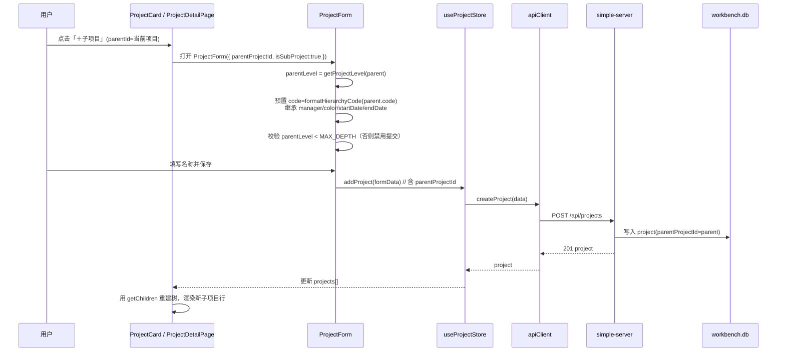
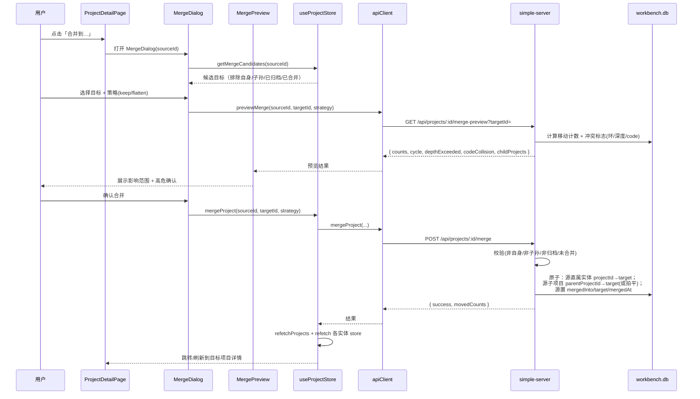
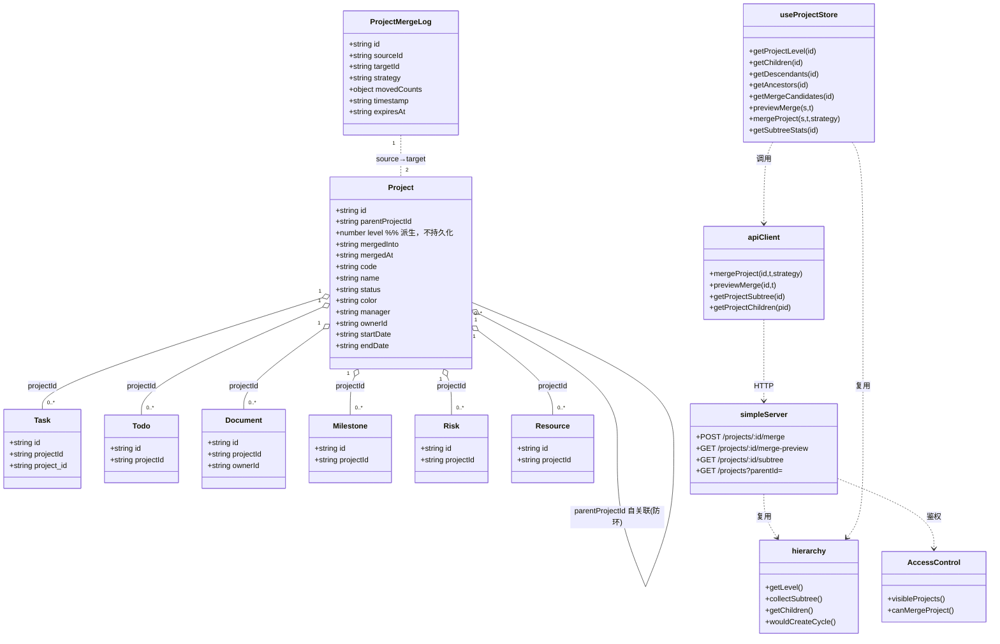
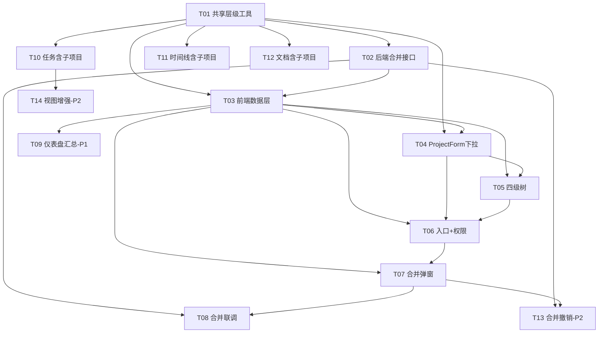

# 项目工作台 · 多级子项目与项目合并 · 技术架构设计 + 任务分解

> 版本：v0.1（架构设计稿，对应 PRD `docs/subproject_plan.md`）
> 作者：高见远（软件架构师 Bob）
> 日期：2026-08-21
> 阅读对象：主理人、工程师（Carol）、测试（Dave）
> 说明：本文档**只做设计**，不修改任何 `src/` / `server/` 源码；所有改动以「任务清单」形式交付工程师执行。

---

## 0. 现状对齐（已逐一验证，非凭空假设）

通过直接阅读源码确认以下事实（而非仅采信 PRD）：

| 项 | 验证结论 | 证据 |
|----|---------|------|
| 技术栈 | React + Vite + Zustand(persist) + Tailwind；Node 纯 HTTP（`server/simple-server.js`）；数据存 `data/workbench.db`（JSON 文件） | `package.json` / `simple-server.js` |
| `parentProjectId` 字段 | **已存在于 project 数据**，但 `ProjectForm` 未渲染其父项目下拉（`parentOptions` 已算好，JSX 缺失） | `useProjectStore`、`ProjectForm.jsx:48,67-84` |
| 子树查询 / 防环 | `ProjectsPage.collectSubtree(rootId)` 已实现（BFS 递归，基于 `parentProjectId`） | `ProjectsPage.jsx:110-123` |
| 子项目展示入口 | `ProjectCard` 已展示「隶属：父项目名」 | `ProjectCard.jsx:71-73,187-189` |
| 各实体关联 | task/todo/document/milestone/risk/resource 均仅经单一 `projectId`（task 还兼容 `project_id`）关联 | `ProjectDetailPage.jsx:48-53` 过滤逻辑、`simple-server.js` 各 PUT 处理 |
| 路由 | 受保护路由：`/projects`、`/projects/:id`、`/tasks`、`/timeline`、`/documents`、`/dashboard` 等，定义在 `src/App.jsx` | `App.jsx` |
| 合并能力 | **0→1 全新模块**；grep 全仓无 `mergedInto`/`merge`/`level`/`MAX_DEPTH` | grep 结果（见下） |
| 后端路由冲突风险 | 现有 `/api/projects/[\w-]+` 用 `PUT`/`DELETE` 正则；新增 `merge` 用 `POST` 不会冲突，但必须置于宽泛 `PUT/DELETE` 之前以防误匹配 | `simple-server.js:508,528` |

> grep 验证命令（已执行）：在 `d:\AI\project-workbench\src` 中检索 `mergedInto|parentProjectId|\.level|MAX_DEPTH|merge` → 仅 `parentProjectId` 命中 4 个文件（ProjectForm / ProjectCard / GanttView / ProjectsPage），其余关键词 0 命中。结论：子项目数据层 ≈90% 就绪，合并须从零实现。

---

## 1. 实现方案与框架选型

**结论：沿用现有技术栈，不引入任何新框架/新依赖。**

- 前端：React 18 + Vite + Zustand(persist) + Tailwind CSS + React Router + lucide-react（图标已在用）。树形缩进与连接线纯用 Tailwind（`pl-X` 缩进 + `border-l-2` 连接线）实现，**无需引入树组件库或拖拽库**（拖拽为 P2-2，本期不做）。
- 后端：沿用 `server/simple-server.js` 纯 Node `http` 服务 + JSON 文件库；新增合并相关路由与 `server/hierarchy.js` 工具模块。
- 层级表达：**持久化字段只有 `parentProjectId`**；`level`（距根距离）为**派生字段**，由 `getProjectLevel(project, allProjects)` 实时计算，**不单独持久化**，杜绝数据漂移。
- 合并表达：用 `mergedInto` 标记隐藏（**软隐藏、非删除**），保留痕迹以便 P2 撤销；合并是**后端单次原子事务**（一次 `saveData` 完成全部实体 `projectId` 重指 + 子项目 `parentProjectId` 改挂），前端只负责调用并刷新缓存——避免各 store 逐一批量改造成「脆弱的多点批量更新」。
- 编号策略：P0 阶段沿用全局顺序号 `XM_001`；层级编号 `XM_001.01`（P1-5）与冲突重排（P1-5）随后追加，**P0 允许 code 重名**（仅弹「重名提醒」）。

---

## 2. 数据模型变更

### 2.1 Project 字段（补录数据字典）

| 字段 | 类型 | 状态 | 说明 |
|------|------|------|------|
| `id` | string(uuid) | 已有 | `crypto.randomUUID()` |
| `parentProjectId` | string \| null | **已有，正式补录** | `null`/`""`/`"__root__"` 表示主项目（根） |
| `level` | number | **派生（不持久化）** | 距根距离：根=0；由 `getProjectLevel` 计算。文档/接口可随响应附带，但**不是** DB 持久列 |
| `mergedInto` | string \| null | **新增（持久化）** | 合并后指向目标项目 id；非 null 即「已隐藏」 |
| `mergedAt` | string \| null | **新增（持久化）** | 合并发生时间 ISO8601 |
| `code` | string | 已有 | P0 仍用 `generateProjectCode` 全局顺序；P1-5 扩展层级编号 |
| 其余 | — | 已有 | name/description/status/color/manager/ownerId/dates/phase/archive* 等不变 |

> 常量：`MAX_DEPTH`（默认 **3**，语义见 §8 待明确 #1）。`level` 取值 `0..MAX_DEPTH`（含），即「根 + 最多 MAX_DEPTH 层子孙」= 最多 4 个展示层级。判定「能否再建子项目」：`getProjectLevel(p) < MAX_DEPTH`。

### 2.2 其他实体（task / todo / document / milestone / risk / resource）

**结构不变**，仅经 `projectId`（task 另兼容 `project_id`）关联。合并时统一改指，无需改各实体 schema。

### 2.3 ProjectMergeLog（P2 撤销预留，可选集合）

在 `workbench.db` 顶层新增 `projectMerges: []`，单条记录：

```jsonc
{
  "id": "uuid",
  "sourceId": "源项目id",
  "targetId": "目标项目id",
  "sourceCode": "XM_003",
  "targetCode": "XM_001",
  "strategy": "keep | flatten",
  "movedCounts": { "tasks": 0, "todos": 0, "documents": 0, "milestones": 0, "risks": 0, "resources": 0, "childProjects": 0 },
  "childOldParentMap": { "childId": "原parentProjectId" },   // 撤销时还原子项目挂接
  "timestamp": "ISO8601",
  "expiresAt": "ISO8601"   // 默认 +24h
}
```

> 本期（P0）**可不建该集合**，合并默认不可撤销（仅强确认）；P2 再补。架构上已为 P2 预留 `mergedInto` 字段作为撤销锚点。

---

## 3. 后端接口设计（`server/simple-server.js` + `server/hierarchy.js`）

> **路由放置顺序（关键）**：新增的 `merge`/`merge-preview`/`subtree` 路由必须写在现有宽泛的 `PUT /api/projects/[\w-]+`（第 508 行）与 `DELETE /api/projects/[\w-]+`（第 528 行）**之前**，避免被泛化正则提前吞掉。由于 merge 用 `POST`，与既有 PUT/DELETE 不会冲突，但顺序仍建议靠前、与 `/archive` 系列并列。

### 3.1 新增 REST 路由

#### (A) 合并预览（只读，不落库）
```
GET /api/projects/:id/merge-preview?targetId=<tid>
```
- 入参：`id`=源项目；`targetId`=目标项目
- 校验（不通过返回 400/409 + error 文案）：
  - 源/目标均存在；`id !== targetId`
  - 目标未归档（`archived !== 1`）
  - 未形成环：`collectSubtree(projects, id)` 不包含 `targetId`
  - 源未已合并：`source.mergedInto == null`
- 出参：
```jsonc
{
  "ok": true,
  "sourceId": "id", "targetId": "tid",
  "counts": { "tasks": 5, "todos": 12, "documents": 2, "milestones": 3, "risks": 1, "resources": 0, "childProjects": 2 },
  "wouldCreateCycle": false,
  "depthExceeded": false,            // 改挂后是否会突破 MAX_DEPTH
  "codeCollision": false,            // 源 code 与目标子树已有 code 是否冲突（P1-5 用）
  "childProjects": [ { "id": "...", "name": "...", "code": "..." } ]
}
```

#### (B) 执行合并（原子写）
```
POST /api/projects/:id/merge
Body: { "targetId": "<tid>", "strategy": "keep" | "flatten" }   // 默认 keep
```
- 前置校验同 (A)；额外：
  - `strategy=keep`：源**直属**子项目 `parentProjectId → target`（保持其自身子孙，层级保留）；若改挂后某子项目 `level > MAX_DEPTH`，递归将其整棵子树拍平到 target（`parentProjectId=target`）。
  - `strategy=flatten`：源**整棵子树**所有后代项目 `parentProjectId → target`（中间层级丢弃）。
  - 源**自身**关联的 task/todo/document/milestone/risk/resource：`projectId → target`（task 同时更新 `project_id`）。
  - 源项目：`mergedInto = target`、`mergedAt = now`（其余字段保留）。
  - 全部变更一次性 `saveData(data)`（原子）。
- 出参：
```jsonc
{ "success": true, "sourceId": "id", "targetId": "tid",
  "movedCounts": { "tasks": 5, "todos": 12, "documents": 2, "milestones": 3, "risks": 1, "resources": 0, "childProjects": 2 },
  "flattened": false }
```
- 错误：环/自身/已合并/已归档 → `409 { error }`；不存在 → `404`。

#### (C) 子树查询
```
GET /api/projects/:id/subtree
```
- 出参：`{ "project": {...}, "descendants": [ {...}, ... ] }`（含全部子孙，用于预览与 `mergedInto` 反查）

#### (D) 按父过滤 / 含已合并
```
GET /api/projects?parentId=<pid|__root__>&includeMerged=0|1
```
- `parentId=__root__` 或省略 → 仅返回根项目（`parentProjectId` 为 null/""/__root__）
- `includeMerged=1` → 不过滤 `mergedInto`（仅管理/撤销场景用）
- 默认（不带 `includeMerged`）**排除 `mergedInto != null` 的项目**

### 3.2 既有接口改动

- `GET /api/projects`（列表与 `visibleProjects`）：默认排除 `mergedInto != null` 的项目（保持隐藏）。
- `GET /api/projects/:id`（详情）：若 `project.mergedInto != null`，返回 `200` 但带 `merged: true` + `mergedInto`，前端显示「已合并到 X」提示而非正常详情。
- `accessControl.visibleProjects` / `visibleProjectIds`：过滤 `mergedInto != null`。新增 `canMergeProject(data,userId,id)` = `canManageProject && !archived && mergedInto == null`。
- （P2）`POST /api/merges/:mergeId/undo` 或 `POST /api/projects/:id/unmerge`：依据 `projectMerges` 日志回滚（还原 `projectId`、`parentProjectId`，清空 `mergedInto/mergedAt`，校验 `expiresAt` 未过期）。

### 3.3 后端层级工具 `server/hierarchy.js`（NEW）

导出（与前端 `src/lib/hierarchy.js` 逻辑一致）：
- `getLevel(projects, id) -> number`（沿 `parentProjectId` 上溯，环保护上限 MAX_DEPTH+2）
- `collectSubtree(projects, rootId) -> Set<id>`（复用现有 ProjectsPage 算法）
- `getChildren(projects, parentId) -> Project[]`
- `wouldCreateCycle(projects, sourceId, targetId) -> boolean`
- `maxSubtreeDepth(projects, rootId) -> number`
- 常量 `MAX_DEPTH = 3`、`ROOT = null`

---

## 4. 前端改造文件清单（相对路径 + 改动点）

### 4.0 共享工具（NEW）
- **`src/lib/hierarchy.js`**（NEW）：前端版 `getLevel / collectSubtree / getChildren / getDescendants / getAncestors / wouldMergeCreateCycle / maxSubtreeDepth / formatHierarchyCode(parentCode, seq)`。把 `ProjectsPage.collectSubtree` 迁移至此，全站复用。
- **`src/lib/hierarchy.js` 中导出 `MAX_DEPTH`、`ROOT` 常量**，单一真源。

### 4.1 `src/store/useProjectStore.js`（MODIFY）
- 新增选择器/方法：`getProjectLevel(id)`、`getChildren(id)`、`getDescendants(id)`、`getAncestors(id)`（P1 面包屑）、`getMergeCandidates(id)`（排除自身/子孙/已归档/已合并）、`previewMerge(sourceId,targetId)`、`mergeProject(sourceId,targetId,strategy)`。
- `getActiveProjects` / `getArchivedProjects` 增加「排除 `mergedInto`」过滤。
- （P1）`getSubtreeStats(id)`：返回 `{ taskTotal, taskDone, progress, incompleteItems, childProjectCount }`，基于**子孙任务完成率**（与 `ProjectsPage` 现有 done/total 口径一致），不依赖存储的 `project.progress`。
- 保留 `generateProjectCode`（P1-5 再扩展层级编号）。

### 4.2 `src/lib/apiClient.js`（MODIFY）
- 新增：`mergeProject(id, targetId, strategy)` → `POST /projects/:id/merge`；`previewMerge(id, targetId)` → `GET /projects/:id/merge-preview`；`getProjectSubtree(id)` → `GET /projects/:id/subtree`；`getProjectChildren(parentId)` → `GET /projects?parentId=`。

### 4.3 `src/components/projects/ProjectForm.jsx`（MODIFY · P0-2）
- 渲染「隶属项目」下拉：把已算好的 `parentOptions` 渲染为 `<select name="parentProjectId">`（当前 JSX 缺失）。
- 新增 props：`parentProjectId`（预置）、`isSubProject`（锁定下拉 + 轻量表单）。
- 预置逻辑：打开为子项目时 → `code = formatHierarchyCode(parent.code, siblings+1)`、`manager = parent.manager`、`color = parent.color`、`startDate/endDate` 继承父区间。
- 深度校验：若 `getProjectLevel(parent) >= MAX_DEPTH` → 禁用提交并 tooltip「已达最大层级（N 级）」。

### 4.4 `src/pages/ProjectsPage.jsx`（MODIFY · P0-3，核心重构）
- 活跃视图由「项目→任务→待办」升级为「**主项目→子项目→任务→待办**」四级树：
  - 用 `hierarchy.getChildren(rootId)` 取根项目；每个项目行展开后渲染「**子项目分组小标题（N 个）**」+「**直属任务分组小标题（M 个）**」两个区。
  - 子项目行**递归/按 level 缩进**（缩进 = `level * 16px`）+ 左侧 `border-l-2` 连接线 + 层级徽标（L0/L1…）。
  - 子项目行可继续展开其下任务/待办（复用现有任务/待办渲染）。
  - 保留：`expandedProjects` 折叠语义（扩展为「展开=子项目+直属任务」）；顶部「全部项目」下拉复用 `collectSubtree`（迁移到 hierarchy 后调用）；「已归档/待审批」仍为卡片网格（不受影响）。
- 深度兜底：当某项目 `level >= MAX_DEPTH` 时，其行内「＋子项目」入口禁用 + tooltip。

### 4.5 `src/components/projects/ProjectCard.jsx`（MODIFY · P0-2）
- hover 操作区新增「＋子项目」图标按钮（仅 `isAdmin || isOwner` 可见），点击 → 打开 `ProjectForm` 并 `parentProjectId=project.id`。
- （可选）标题区显示层级徽标 / 隶属路径。

### 4.6 `src/pages/ProjectDetailPage.jsx`（MODIFY · P0-2 / P0-5 / P1-6 / P2）
- Header 右上新增「**新建子项目**」（owner/admin）与「**合并到…**」（owner/admin）按钮。
- 「合并到…」→ 打开 `MergeDialog`（见 4.7）。
- 若 `project.mergedInto` 非空 → 顶部显示「已合并到 <目标名>」横幅（可跳转）。
- （P1-6）Header 进度环旁加「含子项目」开关，开启时调用 `getSubtreeStats` 聚合展示。
- （P2）若当前项目是某条未过期 `projectMerges` 的 target → 显示「撤销合并」入口。

### 4.7 `src/components/projects/MergeDialog.jsx`（NEW · P0-5）
- 目标选择器：树形列出 `getMergeCandidates(sourceId)`（排除自身/子孙/已归档/已合并）。
- 选目标后调用 `previewMerge` 展示影响预览（`MergePreview`）。
- 策略单选：`keep`（默认，保留层级）/ `flatten`（拍平）。
- 冲突提示：环/深度超限/code 重名 → 高危警告。
- 二次高危确认后调用 `mergeProject` → 成功后 `refetchProjects + refetch` 各实体 store → 跳转到目标项目详情。

### 4.8 `src/components/projects/MergePreview.jsx`（NEW · P0-5）
- 展示 `previewMerge` 返回的 counts 与 `childProjects` 列表、冲突标志。

### 4.9 `src/hooks/useAccess.js`（MODIFY · 层级可见性）
- 新增 `canMergeProject(project) = canManageProject && !archived && !mergedInto`。
- 层级可见性：**子项目继承父项目可见性**——`visibleProjects`/派生集合在返回可见项目后，再补入「可见项目的所有子孙」（沿 `parentProjectId` 向下展开），保证「能看父项目就能看其子项目」。

### 4.10 Dashboard（P1-1）
- `src/pages/DashboardPage.jsx`：新增「**按层级汇总**」开关（默认 **关**）。开启时把 `activeProjects` 经 `getSubtreeStats` 聚合后再传给子组件。
- `src/components/dashboard/ProjectStats.jsx`、`ProgressComparison.jsx`：接收 `includeSubprojects` 与聚合后的 `self / withSubprojects` 双值展示。

### 4.11 跨层级检索（P1-2/3/4）
- `src/pages/TasksPage.jsx` + `TaskList.jsx` + `TaskKanban.jsx`：项目下拉旁加「**含子项目**」勾选；勾选时把筛选项从单 `projectId` 扩展为其 `getDescendants` 集合；列表/看板新增「项目层级」面包屑列（用 `getAncestors` 生成「主项目 / 子项目A」）。
- `src/pages/TimelinePage.jsx` + `MilestoneList.jsx`：里程碑项目筛选支持「含子项目」；按项目分组 + 层级面包屑。
- `src/pages/DocumentsPage.jsx` + `DocumentGrid.jsx`：文档筛选支持「含子项目」；卡片/列表显示「隶属路径」面包屑。
- `src/components/projects/ProjectBreadcrumb.jsx`（NEW，P1）：根据 `getAncestors(id)` 渲染可点击层级路径，供上述页面复用。

### 4.12 后端（见 §3）
- `server/simple-server.js`（MODIFY）、`server/hierarchy.js`（NEW）、`server/accessControl.js`（MODIFY）。

---

## 5. 程序调用流程（关键路径时序）

### 5.1 新建子项目



### 5.2 合并项目（预览 → 强确认 → 原子执行）



---

## 6. 数据模型与类关系（类图）



---

## 7. 依赖与共享知识（跨文件约定）

1. **`MAX_DEPTH` 单一真源**：前端 `src/lib/hierarchy.js` 与后端 `server/hierarchy.js` 各定义一份，值必须一致（默认 3）。改深度只改这两处。
2. **`level` 永不持久化**：任何地方需要层级深度都调用 `getProjectLevel(projects, id)`，不要读/写某字段。`level` 仅作为接口响应里的便利字段，非 DB 列。
3. **递归/防环工具统一复用 `collectSubtree`**：把 `ProjectsPage` 现有实现迁移到 `hierarchy.js`；后端 `server/hierarchy.js` 实现等价算法。新增「查子树/查子孙/查祖先/查子节点」一律走这里，禁止在页面里再写一遍循环。
4. **合并是后端原子事务**：前端**不要**在各 entity store 写「批量 updateProjectId」；只需调用 `mergeProject` 后 `refetchProjects` + `refetch` 各实体 store（task/todo/document/milestone/risk/resource）。数据库一致性由 `simple-server` 单次 `saveData` 保证。
5. **`mergedInto` 过滤纪律**：所有「列项目」的地方（`GET /api/projects`、`visibleProjects`、`getActiveProjects`、`getMergeCandidates`、Dashboard `activeProjects`）都必须排除 `mergedInto != null`（除非显式 `includeMerged=1`）。漏过滤会导致已合并项目「幽灵复现」。
6. **ID 策略**：全部用 `crypto.randomUUID()`，合并不会引起 id 冲突；唯一可能冲突的是人类可读的 `code`（P1-5 处理）。
7. **缩进/连接线规范**：前端树形用 `pl-4`（16px）× level 缩进 + `border-l-2 border-slate-200` 连接线；层级徽标 `L{level}`。
8. **进度/统计口径**：聚合统计（含子项目）一律用「子孙任务完成率 = done/total」计算（与 `ProjectsPage` 现有口径一致），**不依赖**存储的 `project.progress` 字段，避免合并/重挂后进度不一致。
9. **路由顺序铁律**：新增 `/api/projects/:id/merge*` 必须写在宽泛 `PUT/DELETE /api/projects/[\w-]+` 之前。
10. **权限继承**：子项目可见性继承父项目（见 §4.9）；`canManageProject` 暂不改（P2-3 再考虑 owner 继承）。

---

## 8. 待明确事项（需用户/PM 拍板，聚焦技术可行性）

> 以下呼应 PRD 第 5 节 8 问，但已过滤为「影响架构/可实现性」的技术点。

1. **`MAX_DEPTH` 计数口径**（PRD Q1）：当前实现约定 `level∈[0, MAX_DEPTH]`，默认 `MAX_DEPTH=3` ⇒ 根 + 最多 3 层子孙 = **4 个展示层级**。若用户本意是「总共 3 层（根+2 子孙）」则 `MAX_DEPTH=2`。**请确认数值与计数语义**。
2. **层级编号规则**（PRD Q2）：P0 建议沿用全局 `XM_001`；层级编号 `XM_001.01` 放到 P1-5。是否接受分期？
3. **合并后子项目层级处理**（PRD Q3）：默认 `keep`（保留层级改挂目标）；当目标深度不足时**自动拍平**并警告。是否接受「深度超限即拍平」？
4. **合并冲突策略**（PRD Q4）：P0 允许 code 重名（仅「重名提醒」）；P1-5 再做自动重排 `XM_001.02`。是否接受？
5. **合并是否可撤销**（PRD Q5）：P0 默认**不可撤销**（仅强确认）；P2 加 24h 撤销 + 合并日志。是否同意本期不做撤销？
6. **仪表盘默认口径**（PRD Q6）：「按层级汇总」开关默认**关**（扁平、不重复计数）。是否同意默认关？
7. **子项目独立归档 + 权限继承父 owner**（PRD Q7）：归入 P2-3，本期子项目随父项目归档逻辑走（不单独归档、不单独继承 owner 校验）。确认？
8. **`ProjectsPage` 活跃视图重构为树列表**（PRD Q8）：本期将「项目→任务→待办」升级为「主→子→任务→待办」四级树（保留折叠体验与卡片网格的归档/待审批视图）。是否接受该交互变更？
9. **数据字典落地位置（技术）**：PRD 引用的 `requirements_spec_v2.md` / `architecture_design.md` 在本仓库**不存在**（已 glob 验证）。建议新建 `docs/data_dictionary.md` 或在 `subproject_plan.md` 补录 `parentProjectId / level(派生) / mergedInto / mergedAt / MAX_DEPTH`。请确认落点。
10. **`project.progress` 来源（技术）**：`ProjectDetailPage` 直接读 `project.progress`，而 `ProjectsPage` 自行按任务算。聚合统计我将统一按「子孙任务完成率」计算，不回写 `progress`；如希望合并/重挂后也回写 `progress` 字段，请告知（需后端在 merge 时重算写入）。
11. **子项目可见性继承（技术）**：P0 我计划让「能看父项目即能看子项目」（即便子项目下用户无任务）。这会与现有「仅被分配任务才可见」的成员逻辑产生差异，需 PM 确认是否符合预期。

---

## 9. 任务清单（交付重点 · 供工程师 Carol 直接执行）

> 编排原则：先基础设施（T01）→ 后端（T02）→ 前端数据层（T03）→ 子项目创建与树形展示（T04–T06）→ 合并（T07–T08）→ 层级汇总/检索（P1，T09–T12）→ 撤销（P2，T13）。每个任务标注依赖、优先级、源文件。

### 9.1 任务分组总览（5 大模块，便于排期）

| 组 | 范围 | 包含任务 | 优先级 |
|----|------|---------|--------|
| G1 基础设施 | 前后端共享层级工具 + 常量 | T01 | P0 |
| G2 后端 | 合并接口 + 子树查询 + mergedInto 过滤 | T02 | P0（撤销 P2） |
| G3 前端数据层 | store + apiClient 扩展 | T03 | P0 |
| G4 子项目创建与树形展示 | ProjectForm / ProjectsPage / ProjectCard / Detail 入口 | T04,T05,T06 | P0 |
| G5 合并前端 | MergeDialog + 预览 + 强确认 | T07,T08 | P0 |
| G6 层级汇总与跨层检索（P1） | Dashboard / Tasks / Timeline / Documents + 面包屑 | T09,T10,T11,T12 | P1 |
| G7 撤销与增强（P2） | 合并日志 + 24h 撤销 + 拖拽等 | T13(+T14) | P2 |

### 9.2 详细任务清单

- **T01 · 共享层级工具与常量（前后端）** — P0 · 无依赖
  - 源文件：`src/lib/hierarchy.js`(NEW)、`server/hierarchy.js`(NEW)
  - 产出：`getLevel / collectSubtree / getChildren / getDescendants / getAncestors / wouldCreateCycle / maxSubtreeDepth / formatHierarchyCode`；常量 `MAX_DEPTH=3`、`ROOT=null`（两份一致）；把 `ProjectsPage.collectSubtree` 迁移到前端 `hierarchy.js`。

- **T02 · 后端：合并接口 + 子树/子项目查询 + mergedInto 过滤** — P0（撤销 P2） · 依赖 T01
  - 源文件：`server/simple-server.js`(MODIFY)、`server/accessControl.js`(MODIFY)、`server/hierarchy.js`(由 T01 建)
  - 产出：`POST /api/projects/:id/merge`、`GET /api/projects/:id/merge-preview`、`GET /api/projects/:id/subtree`、`GET /api/projects?parentId=&includeMerged=`；`visibleProjects` 排除 `mergedInto`；新增 `canMergeProject`；`GET /:id` 对已合并项目返回 `merged` 标志；路由置于宽泛 PUT/DELETE 之前。**（P2）** `projectMerges` 集合 + `POST /api/merges/:id/undo`。

- **T03 · 前端数据层扩展（store + apiClient）** — P0 · 依赖 T01,T02
  - 源文件：`src/store/useProjectStore.js`(MODIFY)、`src/lib/apiClient.js`(MODIFY)
  - 产出：`useProjectStore` 新增 `getProjectLevel/getChildren/getDescendants/getAncestors/getMergeCandidates/previewMerge/mergeProject`，`getActiveProjects` 排除 merged；`apiClient` 新增 `mergeProject/previewMerge/getProjectSubtree/getProjectChildren`；**（P1）** `getSubtreeStats(id)`。

- **T04 · ProjectForm 渲染父项目下拉 + 预置/深度校验** — P0 · 依赖 T01,T03
  - 源文件：`src/components/projects/ProjectForm.jsx`(MODIFY)
  - 产出：渲染 `parentProjectId` 下拉（用现有 `parentOptions`）；新增 props `parentProjectId`/`isSubProject`；子项目预置 `code=formatHierarchyCode(parent.code, n+1)`、继承 manager/color/dates；`getProjectLevel(parent) >= MAX_DEPTH` 时禁用提交 + tooltip。

- **T05 · ProjectsPage 四级树重构** — P0 · 依赖 T01,T03,T04
  - 源文件：`src/pages/ProjectsPage.jsx`(MODIFY)
  - 产出：活跃视图升级为「主→子→任务→待办」树；`getChildren` 渲染子项目行（缩进+连接线+层级徽标）；分组小标题「子项目 N 个 / 直属任务 M 个」；展开语义扩展；`level>=MAX_DEPTH` 禁用行内「＋子项目」；保留「全部项目」下拉（`collectSubtree`）、归档/待审批卡片网格不变。

- **T06 · ProjectCard「＋子项目」+ ProjectDetailPage 入口** — P0 · 依赖 T04,T05
  - 源文件：`src/components/projects/ProjectCard.jsx`(MODIFY)、`src/pages/ProjectDetailPage.jsx`(MODIFY)、`src/hooks/useAccess.js`(MODIFY)
  - 产出：ProjectCard hover 区加「＋子项目」（owner/admin）；Detail Header 加「新建子项目」「合并到…」按钮；`useAccess` 加 `canMergeProject` 与「子项目继承父可见性」逻辑；（P1-6）Detail 进度环「含子项目」开关。

- **T07 · 合并弹窗与预览（MergeDialog / MergePreview）** — P0 · 依赖 T03,T06
  - 源文件：`src/components/projects/MergeDialog.jsx`(NEW)、`src/components/projects/MergePreview.jsx`(NEW)
  - 产出：目标树选择器（`getMergeCandidates`）、`previewMerge` 影响预览、keep/flatten 策略、冲突高危警告、二次强确认 → 调 `mergeProject` → refetch 并跳目标详情。

- **T08 · 合并执行联调与隐藏态处理** — P0 · 依赖 T02,T07
  - 源文件：`src/pages/ProjectDetailPage.jsx`(MODIFY)、`src/store/useProjectStore.js`(MODIFY)
  - 产出：合并成功后正确隐藏源项目、刷新所有相关 store；源项目详情页访问时显示「已合并到 X」横幅（可跳转）；`getActiveProjects`/Dashboard 不重复计数已合并项。

- **T09 · 仪表盘层级汇总开关** — P1 · 依赖 T03
  - 源文件：`src/pages/DashboardPage.jsx`(MODIFY)、`src/components/dashboard/ProjectStats.jsx`(MODIFY)、`src/components/dashboard/ProgressComparison.jsx`(MODIFY)
  - 产出：「按层级汇总」开关（默认关）；开启时经 `getSubtreeStats` 聚合后传 `self / withSubprojects` 双值展示。

- **T10 · 任务管理「含子项目」筛选 + 面包屑** — P1 · 依赖 T01,T03
  - 源文件：`src/pages/TasksPage.jsx`(MODIFY)、`src/components/tasks/TaskList.jsx`(MODIFY)、`src/components/tasks/TaskKanban.jsx`(MODIFY)、`src/components/projects/ProjectBreadcrumb.jsx`(NEW)
  - 产出：项目下拉旁「含子项目」勾选（扩展为 `getDescendants` 集合）；列表/看板加层级面包屑列。

- **T11 · 时间线「含子项目」分组 + 面包屑** — P1 · 依赖 T01,T03
  - 源文件：`src/pages/TimelinePage.jsx`(MODIFY)、`src/components/timeline/MilestoneList.jsx`(MODIFY)
  - 产出：里程碑项目筛选支持「含子项目」；按项目分组 + 层级面包屑。

- **T12 · 文档「含子项目」筛选 + 面包屑** — P1 · 依赖 T01,T03
  - 源文件：`src/pages/DocumentsPage.jsx`(MODIFY)、`src/components/documents/DocumentGrid.jsx`(MODIFY)
  - 产出：文档筛选支持「含子项目」；卡片/列表显示隶属路径面包屑。

- **T13 · 合并撤销（合并日志 + 限时回滚）** — P2 · 依赖 T02,T07
  - 源文件：`server/simple-server.js`(MODIFY)、`src/store/useProjectStore.js`(MODIFY)、`src/pages/ProjectDetailPage.jsx`(MODIFY)
  - 产出：`projectMerges` 日志写入（T02 预留）；`POST /api/merges/:id/undo` 回滚 `projectId`/`parentProjectId` 并清空 `mergedInto/mergedAt`（校验 24h）；目标项目详情显示「撤销合并」入口。

- **T14 · 层级视图增强（P2-2/P2-3）** — P2 · 依赖 T05,T06
  - 源文件：多处
  - 产出：拖拽调整父子关系、折叠记忆、面包屑点击跳转、跨层级全局搜索、子项目独立归档与权限继承父 owner（需先确认 §8 #7）。

### 9.3 依赖关系图



---

## 10. 验收口径（给测试 Dave 参考）

- P0：可建多级子项目且 `level` 正确、`MAX_DEPTH` 处禁用；项目列表呈四级树；「合并到…」能预览影响并执行，源项目隐藏且数据（任务/待办/文档/里程碑/风险/资源）正确转移到目标，子项目层级保留/拍平符合策略；成员可见性随父项目继承。
- P1：仪表盘「按层级汇总」开关聚合正确（不重复计数）；任务/时间线/文档「含子项目」筛选与面包屑正确。
- P2：合并 24h 内可撤销并完整还原；拖拽/折叠记忆等增强可用。
- 全程：不破坏既有归档/待审批/任务进度联动/轻流推送逻辑；合并为原子写，无半完成态。

> 文档结束。下一步：用户就 §8 待明确事项拍板后，工程师按 T01→T14 顺序实现。
