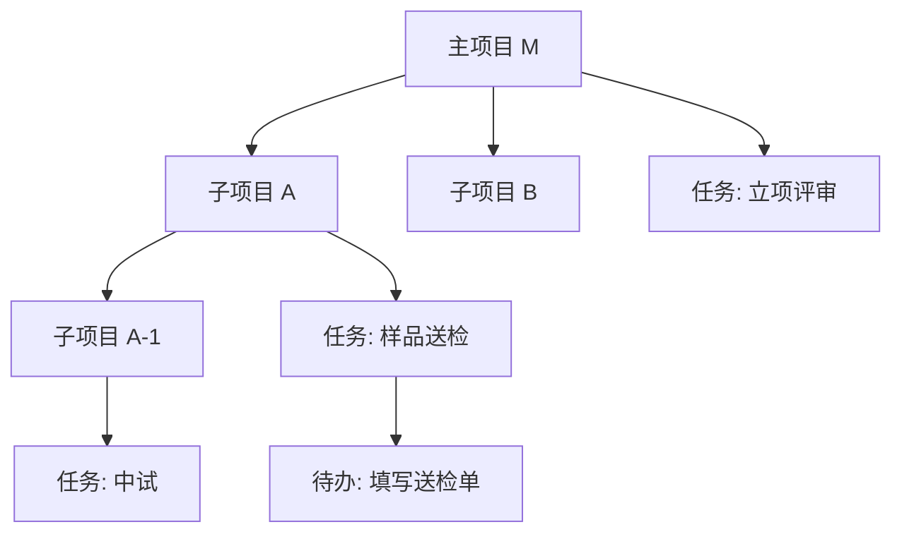

# 子项目与项目合并 功能规划文档（PRD 视角）

> 版本：v1（规划稿）　|　负责人：许清楚（产品经理）　|　面向：项目工作台 `project-workbench`
> 现状基线：`React + Vite + Zustand + Tailwind CSS` 前端，`Node.js` 纯 HTTP 后端（`server/simple-server.js`，数据存于 `data/workbench.db` JSON 文件）

---

## 0. 现状对齐（代码探索结论）

在动笔前已逐文件核对代码，确认以下事实，作为规划前提：

| 维度 | 现状 | 结论 |
| --- | --- | --- |
| 项目字段 | `useProjectStore` 中项目已含 `id, code, name, type, stage, ownerId, manager, status, startDate, endDate, description, archived, archiveStatus, color, createdBy`，且 **已存在 `parentProjectId`** | 父子关系字段已具备，**无需新增核心字段** |
| 新建表单 | `ProjectForm` 已含 `parentProjectId` 输入项，且 `parentOptions` 已做**环检测**（排除自身及全部后代） | 新建子项目的表单能力已具备，仅需换入口与预填 |
| 后端级联 | `DELETE /api/projects/:id` 已按 `parentProjectId` 递归收集「自身+全部后代」并级联删除任务/风险 | 删除子树安全，合并可复用同思路 |
| 实体关联 | `task / todo / milestone / document / risk / resource` 均通过 `projectId`（兼容 `project_id`）归属项目 | 子项目下新建这些实体**天然支持**，只需保证过滤含下属 |
| 项目列表页 | `ProjectsPage` 活跃视图为「项目→任务→待办」三级折叠；`collectSubtree` 仅用于下拉筛选（选中后把整棵子树**拍平**成卡片） | **未做树形/缩进渲染**，这是本次主要缺口 |
| 项目卡片 | `ProjectCard` 网格模式已展示 `隶属：<父项目名>` | 父子关系在卡片层已有展示基础 |
| 成员关系 | 成员用 `projectIds` 数组标记所属项目（`ProjectDetailPage` 据此算 `projectMembers`） | 子项目成员可独立维护 |

**一句话结论**：数据模型与后端已具备「子项目」80% 能力，本次重点是**前端树形展示、层级汇总口径、以及全新的「项目合并」能力**。

---

## 1. 产品目标（一句话）

> 为项目工作台引入「多级子项目」与「项目合并」能力，让半导体靶材业务下的复杂项目能按组织/产品/阶段自然拆层管理、在内容重叠时安全归并，同时保持现有「项目→任务→待办」三级工作视图不变。

---

## 2. 用户故事

### 2.1 新建子项目
- **US-1**（项目负责人）：作为项目负责人，我想在某个主项目下「一键新建子项目」，并自动继承父项目作为上级，以便把大项目按产品线/车间/阶段拆开管理。
- **US-2**（PMO）：作为 PMO，我想在新建子项目时复用现有表单（编号/类型/负责人/颜色/日期），减少重复录入。
- **US-3**（边界）：作为系统，当某项目已处于最大层级时，应**禁止继续向下建子项目**并给出明确提示，避免无限嵌套。

### 2.2 各页面查看层级
- **US-4**（管理层/仪表盘）：作为管理层，我想在仪表盘看到「含子项目」后的汇总进度与任务数，也能量身看单个主项目的整体盘子。
- **US-5**（执行层/项目列表）：作为执行层，我想在项目列表用**树形/缩进**看到主项目→子项目→孙项目的层级，且展开某项目仍能看到它的任务和待办，互不干扰。
- **US-6**（任务管理）：作为任务负责人，我想按「主项目 / 子项目」筛选任务，并能在任务上看到它归属的**项目路径**，避免弄错项目。
- **US-7**（时间线）：作为计划岗，我想里程碑能按项目层级归属与展示，选一个主项目时连同其下属子项目的里程碑一起看。
- **US-8**（文档）：作为文控，我想文档能归属到具体项目层级，并在文档列表看到它属于哪个（子）项目。

### 2.3 项目合并主要场景
- **US-9**（合并发起）：作为项目负责人，运行中我发现某子项目与另一项目内容高度重合，想把它**合并进目标项目**，把所有任务/待办/文档/里程碑/风险一起搬过去。
- **US-10**（合并预览）：合并前，我想先**预览**会移动多少任务/文档/里程碑，并确认子项目层级怎么处理（拍平还是保留），避免误操作。
- **US-11**（冲突与撤销）：合并时若出现同名/同编号，系统应自动处理而非报错；且合并后若发现合并错了，我想能**撤销**回退。

---

## 3. 功能需求池（P0 / P1 / P2）

> 标注：影响页面/模块（P=ProjectsPage, D=DashboardPage, T=TasksPage, TL=TimelinePage, Doc=DocumentsPage, PD=ProjectDetailPage, ST=Store, SV=Server）

### P0（必须有）
| 编号 | 需求 | 优先级 | 影响模块 |
| --- | --- | --- | --- |
| F-01 | **子项目数据模型与层级深度约束**：复用 `parentProjectId`；新增「层级深度」计算与**最大层数拦截**（后端创建时若 `parent 深度 ≥ 上限` 则 403）。初始假设上限=3 层子孙（具体见 §5） | P0 | ST, SV, ProjectForm |
| F-02 | **新建子项目入口 + 表单**：项目卡片（hover 操作区）与项目详情页头部新增「新建子项目」按钮；点击后复用 `ProjectForm` 并预填 `parentProjectId`、默认继承父项目 `ownerId/color` | P0 | ProjectCard, PD, ProjectForm, P |
| F-03 | **项目列表树形/缩进展示**：活跃视图改为按 `parentProjectId` **递归渲染缩进树**（带连接线），每个项目节点内仍保留「任务→待办」折叠，二者不冲突 | P0 | P |
| F-04 | **层级展开/折叠状态管理**：`expandedProjects` 按 `projectId` 维护；节点展开区同时容纳「子项目（递归）+ 本层任务」，点击展开箭头只控制本节点显隐 | P0 | P |
| F-05 | **各实体归属子项目**：验证并补全 task/todo/milestone/document/risk 在子项目下的新建与「按项目过滤含下属」逻辑（现有 `projectId` 关联已支持，主要是过滤口径） | P0 | T, TL, Doc, PD, ST |
| F-06 | **仪表盘层级汇总口径**：新增「含子项目」开关；进度=子树 done/total 加权、任务数/未完成事项按子树聚合；全局统计默认含全部层级 | P0 | D, ST |
| F-07 | **项目合并-规则与执行（后端）**：新增 `POST /api/projects/:id/merge`，将源项目下全部 task/todo/milestone/document/risk/resource 的 `projectId` 改写为目标；源项目标记 `mergedInto` 并隐藏；写入 `mergeLog`（记录被移动实体 ID） | P0 | SV |
| F-08 | **项目合并-前端流程**：合并入口（详情页/卡片）、目标项目选择、影响预览（分类型计数）、二次确认 | P0 | PD, ProjectCard, 新建 MergeModal |
| F-09 | **合并可撤销**：基于 `mergeLog` 提供 `POST /api/merges/:id/undo`，把被移动实体 `projectId` 还原、源项目重新激活 | P0 | SV, 前端 |

### P1（应有）
| 编号 | 需求 | 优先级 | 影响模块 |
| --- | --- | --- | --- |
| F-10 | 任务/时间线/文档的「项目筛选」改为**树形下拉**（缩进+含下属切换） | P1 | T, TL, Doc |
| F-11 | 任务行/文档卡片/里程碑行显示**项目路径面包屑**（如 `主项目 / 子项目A`）以明确归属 | P1 | T, TL, Doc |
| F-12 | 时间线甘特图按项目层级**分组/缩进**展示里程碑 | P1 | TL |
| F-13 | 合并影响预览细化：分类型（任务/待办/里程碑/文档/风险/资源）展示将被移动的数量与重名项 | P1 | 新建 MergeModal |
| F-14 | 子项目**成员默认策略**（可选继承父项目成员 / 仅建空成员） | P1 | ST, SV, PD |
| F-15 | 层级**面包屑/深度标识** UI（在卡片与详情页展示「第 N 层」或路径） | P1 | P, PD |

### P2（可有）
| 编号 | 需求 | 优先级 | 影响模块 |
| --- | --- | --- | --- |
| F-16 | 子项目**改父/移动**（把某子项目挂到另一个父项目下） | P2 | ST, SV, P |
| F-17 | 跨项目**复制任务**到子项目 | P2 | T, ST |
| F-18 | 合并完成后**自动通知**相关成员（复用现有 notification） | P2 | SV, ST |
| F-19 | 子项目**模板**（从已有子项目快速克隆结构与字段） | P2 | ST, SV |
| F-20 | 用户展开/折叠状态**本地持久化**（刷新后保持） | P2 | P |

---

## 4. 关键交互设计

### 4.1 新建子项目入口
- **入口 A — 项目列表卡片**：在 `ProjectCard` 的 hover 操作区新增「➕ 新建子项目」图标（仅 `owner/admin` 可见），点击等价于打开 `ProjectForm` 并预填 `parentProjectId = 当前项目.id`。
- **入口 B — 项目详情页头部**：在 `ProjectDetailPage` 顶部操作区新增「新建子项目」按钮，进入同一表单。
- **入口 C — 列表树内联**：在 `ProjectsPage` 每个展开的项目节点右端增加「＋子项目」按钮，直接在该父节点下建子项目。
- **表单复用**：直接复用 `ProjectForm`；`parentOptions` 已排除自身及后代（防环）；默认继承父 `ownerId`、`color`、`type`，用户可改。
- **深度拦截**：保存时若 `当前父深度 + 1 > 上限` → 后端 403，前端 `alert('已达最大子项目层级，无法继续向下拆分')`。

### 4.2 层级展示方式建议（重点：与现有三级折叠不冲突）
建议将 `ProjectsPage` 活跃视图重构为**递归 `ProjectNode` 组件**：

```
▾ 主项目 M（进度 40%，12 任务）            ← 第1层
   ├ ＋子项目 · ▾ 子项目 A（进度 55%）      ← 第2层（缩进 + 连接线）
   │     ├ 子项目 A-1（进度 70%）           ← 第3层
   │     └ 任务：样品送检（进行中）          ← 仍保留 任务→待办
   │            └ ☑ 待办：填写送检单
   └ 任务：立项评审（已完成）
```

- **外圈 = 项目层级树**（由 `parentProjectId` 决定缩进深度，带左侧竖线连接线）。
- **内圈 = 工作三层**（每个项目节点展开后，先列其**直接子项目**（递归），再列其**本层任务**；任务展开再列待办）。
- **展开状态分离**：`expandedProjects[id]` 控制「是否显示该节点的子项目+任务」；`expandedTasks[id]` 控制「是否显示该任务的待办」。两者独立，互不干扰。
- **缩进实现**：`paddingLeft = 16 + depth * 20 px`，并在左侧绘制层级连接线，深度用浅色「L1/L2/L3」角标提示。
- **顶部下拉筛选**保留并升级：选中主项目 → 显示其整棵子树（沿用 `collectSubtree`），但改为**树形渲染**而非拍平。

### 4.3 合并操作流程
```
1) 入口：项目详情页「合并到…」或卡片「合并」(owner/admin)
2) 选择目标项目（树形下拉，排除自身及后代，防环）
3) 系统计算并预览：
   - 源项目下：X 任务 / Y 待办 / Z 里程碑 / M 文档 / N 风险 / K 资源
   - 源项目下还有 W 个子项目（含其子孙）
   - 提示重名项（同名项目/文档）
4) 选择「子项目层级处理」方式（拍平 / 保留，见 §5）
5) 二次确认弹窗（红色危险提示，列出移动量）
6) 执行：源全部实体 projectId → 目标；源标记 mergedInto=目标.id 并隐藏
7) 写入 mergeLog（movedEntityIds[]）
8) 结果页提供「撤销合并」入口（24h 内/管理员可撤）
```

**冲突处理默认策略（待用户确认，见 §5）**：
- **编号冲突**：`code` 由系统全局自增（`XM_xxx`）且唯一，源项目保留自身编号迁入历史，不与目标冲突；若用户要求「回收编号」再议。
- **重名冲突**：允许同名共存（项目/文档均允许重名），UI 以「项目路径」区分；合并预览中高亮重名项供人工确认。
- **负责人/成员冲突**：不冲突，合并后目标项目成员 = 原目标 ∪ 源项目成员（去重）。

---

## 5. 各页面展示规划（逐页方案）

### 5.1 仪表盘（DashboardPage）
- **现状**：`activeProjects = 全部未归档`，各 StatCard 直接对所有活跃项目求和；未完成事项 = 进行中+待启动任务 + 未完成待办。
- **方案**：
  1. 新增开关 **「含子项目汇总」**（默认开）。开启时，所有聚合按 `collectSubtree` 把每个项目的子孙并入其直属父后再汇总；关闭时，每个项目独立计数（与现状一致）。
  2. **进度口径**：某（主）项目进度 = 子树内 `done 任务 / 总任务`（与现有 `doneTasks/taskTotal` 同公式，仅把 `tasksByProject[id]` 扩展为 `tasksBySubtree(id)`）。
  3. **任务总数 / 待达成里程碑 / 待处理风险 / 团队成员 / 未完成事项** 均改为基于「子树 + 全部层级」聚合；`ProjectStats / ProgressComparison` 组件入参由 `activeProjects` 改为「带子树聚合后的项目视图」。
  4. 顶部 StatCard 增加 tooltip：「含 N 个子项目」。
- **边界**：归档项目不计入；合并后 `mergedInto` 的源项目不计入（避免重复）。

### 5.2 项目列表（ProjectsPage）— 重点
- 见 §4.2：重构为递归树，外圈项目层级、内圈任务→待办，展开状态分离。
- **不冲突原则**：现有「项目→任务→待办」三级折叠**完全保留**，子项目作为「项目节点的子节点」插入到同一展开区，不与任务层混淆（视觉上子项目行用项目色点、任务行用状态色，区分明显）。

### 5.3 任务管理（TasksPage）
- **筛选**：项目下拉改为**树形下拉**，选项缩进显示层级；新增「含下属」勾选（默认勾选），勾选时 `filteredTasks` 用 `collectSubtree(projectFilter)` 取该项目的全部子孙任务。
- **归属清晰**：任务卡片/行增加**项目路径 chip**（`主项目 / 子项目A`），看板列与列表均显示，避免跨项目误读。
- **新建**：`TaskForm` 的 `defaultProjectId` 来自筛选或详情页，子项目下新建任务时 `projectId` 直接写子项目（已支持）。

### 5.4 时间线（TimelinePage）
- **里程碑归属**：里程碑已按 `projectId` 归属；项目筛选下拉同样改为树形 + 「含下属」；选中主项目时 `filteredMilestones` 用子树聚合（沿用 `collectSubtree` 思路）。
- **甘特分组**：`GanttView` 按项目层级**分组缩进**展示任务条与里程碑，子项目任务缩进于父项目之下，体现层级。
- **新建里程碑**：`MilestoneForm` 的 `defaultProjectId` 可指向子项目。

### 5.5 文档管理（DocumentsPage）
- **归属**：文档已带 `projectId`；列表每项显示**项目路径 chip**，明确归属到哪一层。
- **筛选**：项目下拉树形化 + 「含下属」；`filteredDocs` 用子树聚合。
- **新建**：`DocumentForm` 的 `projects` 选项含全部活跃项目（含子项目），用户选具体层级。

---

## 6. 项目合并（详细规划）

### 6.1 触发入口
- 项目详情页头部「合并到…」按钮（owner/admin 可见）。
- 项目卡片 hover 操作区「合并」图标。
- （P2）可在项目列表多选后批量合并。

### 6.2 合并规则
| 实体 | 处理方式 |
| --- | --- |
| 任务 task | `projectId` 由源 → 目标（含 `project_id` 兼容字段） |
| 待办 todo | `projectId` 由源 → 目标（todo 同时挂 task，task 已迁移故自动跟随） |
| 里程碑 milestone | `projectId` 由源 → 目标 |
| 文档 document | `projectId` 由源 → 目标 |
| 风险 risk | `projectId` 由源 → 目标 |
| 资源 resource | `projectId` 由源 → 目标 |
| 子项目（源的下级） | 见 §6.3 层级处理（拍平 / 保留，待确认） |
| 源项目自身 | 标记 `mergedInto = 目标.id`、`status='merged'`、从活跃列表隐藏，但**记录保留**以支持撤销 |

### 6.3 子项目层级处理（待用户拍板）
- **方案 A（拍平）**：源的全部子孙子项目的 `parentProjectId` 统一改为 `目标.id`，即并入后都成为目标的直属子项目（层级不深但结构变浅）。
- **方案 B（保留）**：源的整棵子树**整体挂到目标下**（源的 `parentProjectId = 目标.id`，其子孙不变），完整保留原有嵌套。
- **推荐**：默认 **方案 B（保留）**，因信息不丢失；但若目标本身已较深，需受 F-01 深度上限约束，超限则自动退化为方案 A 或拒绝。

### 6.4 冲突处理
- **同编号**：系统 `code` 全局唯一自增，源项目迁入历史后编号保留不冲突；如需「回收/重排编号」列为 P2。
- **重名**：项目与文档均允许重名，合并预览中**高亮重名项**，以项目路径区分；不阻断合并。
- **负责人/成员**：目标成员 = 原目标 ∪ 源（去重），无冲突。

### 6.5 是否可撤销
- **可撤销（默认）**：合并时写入 `mergeLog { id, sourceId, targetId, movedEntityIds:[...], createdAt }`；提供 `POST /api/merges/:id/undo`：
  1. 把 `movedEntityIds` 中实体的 `projectId` 还原为 `sourceId`；
  2. 若源有子孙且采用方案 B，复原其 `parentProjectId`；
  3. 清除源 `mergedInto`、恢复 `status`，重新进入活跃列表。
- **权限/时效**：仅管理员或源项目原 owner 可撤销；建议保留 `mergeLog` 至少 30 天（或永久保留，体积小）。

### 6.6 后端改动清单
- `POST /api/projects/:id/merge`（需 `canManageProject` 校验源与目标）
- `POST /api/merges/:id/undo`
- `workbench.db` 新增 `merges` 数组；`projects` 增加 `mergedInto`、`status:'merged'` 支持
- 复用现有 `collectSubtree` 思路遍历子孙与关联实体

---

## 7. 待确认问题清单（需用户拍板）

1. **「向下三级」的精确层数定义**：是「主项目(1) + 最多 3 层子孙（共 4 层）」还是「总共不超过 3 层（主+2 层子孙）」？直接影响 F-01 深度上限与后端拦截值。
2. **合并后子项目层级处理**：采用「拍平到目标直属」（方案 A）还是「整体保留挂到目标下」（方案 B）？超限时是否允许退化为拍平？
3. **合并冲突策略**：同名项目/文档是否允许共存（推荐允许）？编号是否需回收重排（默认不回收）？
4. **合并是否必须可撤销 & 时效**：确认默认「可撤销 + mergeLog 永久保留」，还是仅管理员可撤、是否有时间窗？
5. **子项目成员默认策略**：新建子项目时，是否自动继承父项目成员（F-14）？还是从空开始由负责人自行添加？
6. **仪表盘默认口径**：全局统计默认「含全部子项目层级」还是「仅直属」？「含子项目汇总」开关默认开还是关？
7. **超层级边界行为**：已达最大层级的项目的「新建子项目」按钮，是**置灰禁用**还是**点击后报错提示**？
8. **编号规则是否随层级变化**：子项目编号是否沿用全局 `XM_xxx` 自增（推荐），还是需要「主项目编号-子序号」式层级编号（如 `XM_001.1`）？
9. **合并范围是否含已归档子项目**：合并时，源的已归档子孙是否一并迁入目标（推荐仅迁移活跃，归档项保持原位）？

---

## 附录：层级展示概念图（Mermaid）



> 说明：外圈为「项目层级树」（parentProjectId），内圈为「任务→待办」工作三层；两者在 UI 上通过缩进与颜色区分，互不冲突。
