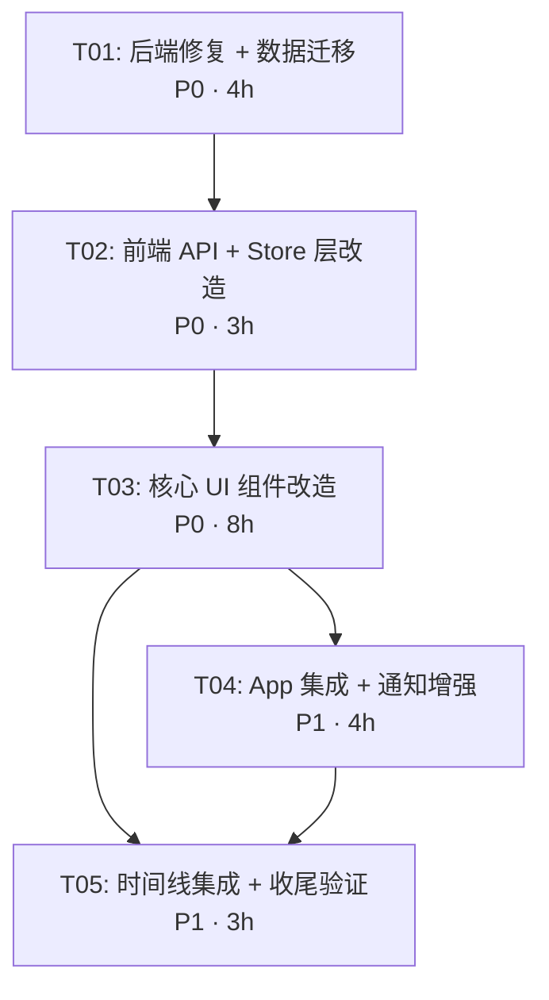

# 项目工作台 — 任务分解文档

> 版本：v2.0
> 日期：2026-08-15
> 基于：`requirements_spec_v2.md`

---

## 任务总览

| 任务 ID | 任务名称 | 优先级 | 估算工时 | 前置任务 |
|---------|----------|--------|----------|----------|
| T01 | 后端修复 + 数据迁移 | P0 | 4h | 无 |
| T02 | 前端 API + Store 层改造 | P0 | 3h | T01 |
| T03 | 核心 UI 组件改造 | P0 | 8h | T02 |
| T04 | App 集成 + 通知系统增强 | P1 | 4h | T03 |
| T05 | 时间线集成 + 收尾验证 | P1 | 3h | T03, T04 |

**总计**：22h，关键路径：T01 → T02 → T03 → T04 → T05

---

## T01 — 后端修复 + 数据迁移

### 目标
修复 P0-1/2/3/4/5 五个阻断性 Bug，补齐归档审批 API，编写数据迁移脚本。

### 涉及文件
| 文件 | 操作 | 说明 |
|------|------|------|
| `server/scripts/migrate.js` | 新建 | 启动时运行，为 projects/tasks/todos 表新增字段设置默认值 |
| `server/simple-server.js` | 修改 | 新增 4 个端点 + 修复级联删除 + 修复字段名 |

### 具体改动

#### 1. 新建 `server/scripts/migrate.js`
```javascript
// 启动时自动调用 migrate(dbPath)
// 逻辑见 architecture_design.md §2.4
```

#### 2. `server/simple-server.js` 修改清单

**修复 P0-1**：新增 `GET /api/tasks` 端点（无 projectId 参数时返回全部）
```javascript
if (pathname === '/api/tasks' && method === 'GET') {
    const data = loadData();
    sendResponse(res, 200, data.tasks);
    return;
}
```

**修复 P0-5**：`GET /api/projects/:id/tasks` 中字段名从 `project_id` 改为 `projectId`
```javascript
// 改前
const tasks = data.tasks.filter(t => t.project_id === projectId);
// 改后（兼容两者）
const tasks = data.tasks.filter(t => t.projectId === projectId || t.project_id === projectId);
```

**修复 P0-4**：新增归档系列端点
```javascript
// POST /api/projects/:id/archive
// POST /api/projects/:id/approve-archive
// POST /api/projects/:id/reject-archive
// POST /api/projects/:id/restore
```

**修复 P0-4 + P1-2**：`DELETE /api/projects/:id` 增加级联删除
```javascript
// 删除项目前，先删除该项目的全部任务
const tasksToDelete = data.tasks.filter(t => t.projectId === id);
tasksToDelete.forEach(t => deleteTaskFromDB(t.id));
data.projects.splice(index, 1);
```

**修复 P0-2/P0-3 关联**：`POST /api/projects/:id/tasks` 确保正确存储 `projectId`

### 验收标准
- [ ] `GET /api/tasks` 返回全部任务（无 projectId 限制）
- [ ] `GET /api/projects/:id/tasks` 能正确返回项目关联任务
- [ ] `DELETE /api/projects/:id` 后，关联任务全部消失
- [ ] 归档申请端点返回 `{ archiveStatus: 'requested' }`
- [ ] 审批通过后，关联任务 status 变为 `archived`
- [ ] 恢复项目后，关联任务 status 还原为原值
- [ ] 启动时 migrate.js 无报错执行

---

## T02 — 前端 API + Store 层改造

### 目标
在 apiClient 中补齐归档相关方法，扩展三个 Store，统一字段名。

### 涉及文件
| 文件 | 操作 | 说明 |
|------|------|------|
| `src/lib/apiClient.js` | 修改 | 新增 5 个归档方法 |
| `src/store/useTaskStore.js` | 修改 | fetchTasks 支持无参、getTasksByProject 修复、新增级联删除 |
| `src/store/useProjectStore.js` | 修改 | 新增 4 个归档方法 |
| `src/store/useTodoStore.js` | 修改 | toggleTodo 兼容 completedAt、新增按 taskId 查询 |

### 具体改动

#### apiClient.js 新增方法
```javascript
// Projects 归档
async archiveProject(id, reason, note) {
    return this.request(`/projects/${id}/archive`, {
        method: 'POST', body: JSON.stringify({ reason, note })
    });
}
async approveArchive(id) {
    return this.request(`/projects/${id}/approve-archive`, { method: 'POST' });
}
async rejectArchive(id) {
    return this.request(`/projects/${id}/reject-archive`, { method: 'POST' });
}
async restoreProject(id) {
    return this.request(`/projects/${id}/restore`, { method: 'POST' });
}
```

#### useTaskStore.js 关键修改
```javascript
// fetchTasks 支持无参（获取全部）
fetchTasks: async (projectId) => {
    const tasks = projectId
        ? await apiClient.getTasks(projectId)
        : await apiClient.getAllTasks();  // 新增
    set({ tasks });
},
// 修复字段名
getTasksByProject: (projectId) =>
    get().tasks.filter((t) => t.projectId === projectId),  // 不是 project_id
// 新增级联删除
deleteTasksByProject: async (projectId) => {
    const tasks = get().getTasksByProject(projectId);
    await Promise.all(tasks.map(t => get().deleteTask(t.id)));
},
```

#### useProjectStore.js 新增方法
```javascript
archiveProject: async (id, reason, note) => { ... }
approveArchive: async (id) => { ... }
rejectArchive: async (id) => { ... }
restoreProject: async (id) => { ... }
getRequestedProjects: () => get().projects.filter(p => p.archiveStatus === 'requested')
```

#### useTodoStore.js 修改
```javascript
// toggleTodo 兼容 completedAt / completed_at
toggleTodo: async (id) => {
    const todo = get().todos.find((t) => t.id === id);
    if (!todo) return;
    const updated = await get().updateTodo(id, {
        completed: !todo.completed,
        completedAt: !todo.completed ? new Date().toISOString() : null,
        completed_at: !todo.completed ? new Date().toISOString() : null,  // 兼容
    });
    return updated;
},
// 新增按 taskId 查询
getTodosByTask: (taskId) => get().todos.filter((t) => t.taskId === taskId),
```

### 验收标准
- [ ] `apiClient.getAllTasks()` 返回全部任务
- [ ] `useTaskStore.fetchTasks()` 不传参时加载所有任务
- [ ] `useProjectStore.archiveProject()` 能正确调用后端
- [ ] `useTodoStore.toggleTodo()` 不报错，completedAt 写入正确
- [ ] localStorage `pw_tasks` / `pw_projects` / `pw_todos` 正常读写

---

## T03 — 核心 UI 组件改造

### 目标
修复 Bug、重构 TaskDetailModal、重构 TodosPage、逾期高亮。

### 涉及文件
| 文件 | 操作 | 说明 |
|------|------|------|
| `src/components/tasks/TaskForm.jsx` | 修改 | addTask 传 projectId 参数 |
| `src/components/tasks/TaskDetailModal.jsx` | 新建 | 左右分栏：待办 + 进度汇报 |
| `src/pages/TodosPage.jsx` | 重构 | 待办/任务独立 section + 筛选标签 |
| `src/components/todos/TodoList.jsx` | 修改 | 逾期高亮 + 截止日排序 |
| `src/pages/ProjectsPage.jsx` | 修改 | 归档申请弹窗 + 待审批标签页 + 卡片跳转时间线 |

### 具体改动

#### TaskForm.jsx 修复
```javascript
// 改前
addTask({ ...form, tags: ... });
// 改后
addTask(form.projectId, { ...form, tags: ... });
```

#### 新建 TaskDetailModal.jsx
```jsx
// 左右分栏布局
// 左侧 60%：TodoList（仅显示该任务的待办，支持勾选完成 + 新增待办）
// 右侧 40%：进度汇报历史表格 + 新增汇报表单
// 底部：保存并关闭按钮
// 打开时调用 fetchTodos() 确保数据最新
```

#### TodosPage.jsx 重构
```
布局结构：
├── 统计卡片（待办逾期 / 今日到期 / 任务进行中 / 已完成待办）
├── ReminderBanner
├── 工具栏（筛选标签：全部/待办/任务/进行中/已完成）
├── 【待办 section】（独立 h2 + TodoList）
│   └── items={filteredTodos} onToggle={toggleTodo}
├── 【任务 section】（独立 h2 + TaskList）
│   └── items={filteredTasks} onProgress={handleProgressTask}
└── 弹窗（TodoForm / TaskDetailModal / ConfirmDialog）
```

#### TodoList.jsx 逾期高亮
```jsx
// 判断条件：dueDate < today && !completed
// 样式：bg-red-50 border-red-200，截止日期红色加粗，右侧 badge "逾期 N 天"
// 排序：逾期项置顶 → 有截止日升序 → 同天按优先级
```

#### ProjectsPage.jsx 改动
- 项目卡片 `onClick` → `navigate('/timeline?projectId=' + project.id)`
- 新增「待审批归档」标签页（仅 admin 可见）
- 归档按钮 → 弹出原因选择弹窗（下拉 + 文本框）
- 已归档项目卡片增加「恢复」按钮

### 验收标准
- [ ] 新建任务时 projectId 正确传入，任务绑定到项目
- [ ] 点击任务卡片 → 打开 TaskDetailModal，左侧有待办列表，右侧有进度汇报
- [ ] 弹窗内新增待办，自动携带 projectId 和 taskId
- [ ] TodosPage 待办和任务分两个独立区域展示，不混排
- [ ] 逾期待办红色高亮，显示"逾期 N 天"
- [ ] 待办按截止日升序，无截止日的排最后
- [ ] 项目卡片点击跳转 `/timeline?projectId=xxx`
- [ ] 「待审批归档」标签页仅 admin 可见，显示 archiveStatus=requested 的项目

---

## T04 — App 集成 + 通知系统增强

### 目标
App.jsx 启动时加载任务；通知类型扩展；归档审批 UI 完善。

### 涉及文件
| 文件 | 操作 | 说明 |
|------|------|------|
| `src/App.jsx` | 修改 | 启动时并行调用 fetchTasks() |
| `src/pages/ProjectsPage.jsx` | 修改 | 归档申请弹窗 + 审批操作按钮 + 恢复按钮逻辑完善 |
| `src/store/useNotificationStore.js` | 修改 | 扩展 NOTIF_TYPES |
| `src/store/useProjectStore.js` | 修改 | 归档/审批成功后触发通知创建 |

### 具体改动

#### App.jsx
```javascript
// loadFromApi 中并行加载 tasks
const [projects, todos, members, tasks] = await Promise.all([
    fetchProjects(), fetchTodos(), fetchMembers(), fetchTasks()
]);
```

#### NOTIF_TYPES 扩展
```javascript
export const NOTIF_TYPES = {
    task_reminder: { label: '任务提醒', icon: '🔔', color: '#3b82f6' },
    project_update: { label: '项目更新', icon: '📊', color: '#8b5cf6' },
    milestone: { label: '里程碑', icon: '🏁', color: '#10b981' },
    risk_alert: { label: '风险预警', icon: '⚠️', color: '#ef4444' },
    system: { label: '系统通知', icon: 'ℹ️', color: '#64748b' },
    // 新增
    archive_requested: { label: '归档申请', icon: '📋', color: '#f59e0b' },
    archive_approved: { label: '归档通过', icon: '✅', color: '#10b981' },
    archive_rejected: { label: '归档驳回', icon: '❌', color: '#ef4444' },
    project_deleted: { label: '项目删除', icon: '🗑️', color: '#64748b' },
};
```

#### useProjectStore 通知触发
```javascript
// archiveProject 成功后：
const adminMembers = members.filter(m => m.role === 'admin');
adminMembers.forEach(m => notificationStore.addNotification({
    type: 'archive_requested',
    title: '新项目归档申请',
    message: `「${project.name}」提交归档申请，等待审批`,
    user_id: m.id,
}));

// approveArchive 成功后：
// 通知申请人和项目成员
// rejectArchive 成功后：
// 通知申请人
```

### 验收标准
- [ ] App 启动时任务列表正常加载（不再是空数组）
- [ ] 提交归档申请后，管理员收到站内通知
- [ ] 审批通过后，项目成员收到归档通知
- [ ] 项目删除后，成员收到删除通知

---

## T05 — 时间线集成 + 收尾验证

### 目标
TimelinePage 支持 URL 参数过滤；端到端验收验证。

### 涉及文件
| 文件 | 操作 | 说明 |
|------|------|------|
| `src/pages/TimelinePage.jsx` | 修改 | URL query 解析 + 项目过滤锁定 + 甘特图起点 |
| `src/pages/ProjectsPage.jsx` | 完善 | 已归档列表筛选逻辑完善 |

### 具体改动

#### TimelinePage.jsx
```javascript
// 读取 URL query
const projectId = new URLSearchParams(window.location.search).get('projectId');
const [projectFilter, setProjectFilter] = useState(projectId || '');

// 如果来自 URL 参数，锁定选择器（禁用）
<Select label="项目" value={projectFilter} onChange={setProjectFilter} disabled={!!projectId} ... />

// 甘特图起点：取自项目 startDate
const project = projects.find(p => p.id === projectFilter);
const ganttStart = project?.startDate || getEarliestStartDate(allTasks);
```

#### 端到端验证清单
- [ ] 创建项目 → 编辑 → 归档申请 → 审批通过 → 项目移入已归档 ✓
- [ ] 项目归档后，关联任务 status 变为 archived ✓
- [ ] 删除项目 → 关联任务全部消失 ✓
- [ ] 点击项目卡片 → 跳转时间线，仅显示该项目任务 ✓
- [ ] 任务弹窗左侧有待办列表，可勾选完成 ✓
- [ ] 待办提醒页勾选完成 → 任务弹窗内该待办已标记完成 ✓
- [ ] 待办列表独立展示，逾期项红色高亮 ✓
- [ ] 待办按截止日升序排列 ✓
- [ ] 管理员可见「待审批归档」标签页 ✓

---

## 任务依赖图



---

*文档结束*
